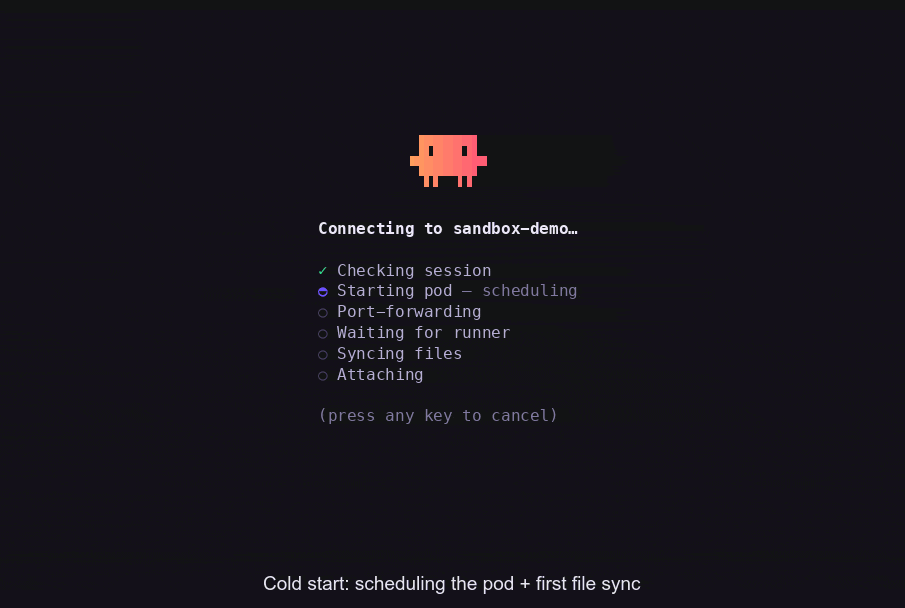
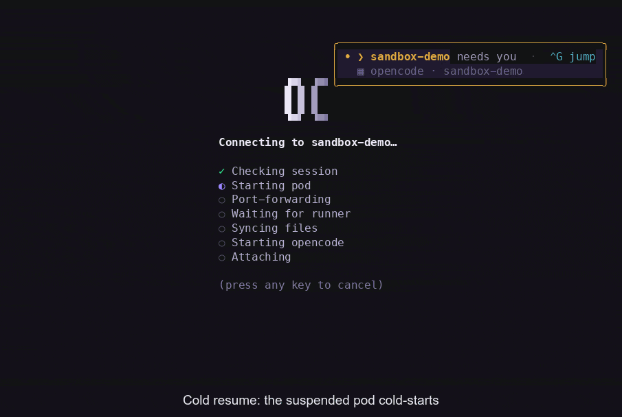

# sandbox

Run **Claude** and **OpenCode** coding agents on a remote Kubernetes cluster
instead of on your laptop. Each session is its own pod that keeps its state on a
PVC, so you can detach, close the lid, and pick the conversation back up later —
or run several agents in parallel without tying up your machine.

You drive it all from a local terminal UI: a command-center dashboard that lists
your sessions, flags the ones waiting on you, and drops you into the **agent's
own TUI** — the real Claude Code or opencode interface, running in the pod,
streamed to your terminal. The agents run on the cluster; your keystrokes and
files stay local. It targets a cluster running the
[agent-sandbox](https://github.com/kubernetes-sigs/agent-sandbox) controller
(v0.4.6).

<p align="center">
  
  <br>
  <sub><em>Cold-start a Claude session: the pod schedules + syncs (fast-forwarded), then you chat — all from your terminal.</em></sub>
</p>

> **Status — early.** The core paths (runner image, live turns, Mutagen-over-SSH
> sync) have been validated on a real cluster, but the claude-pane path
> (2026-07) is unit/e2e-tested only and still awaits its live cluster pass.
> Treat this as a working prototype, not a turnkey product — see the
> [unvalidated paths](docs/architecture.md#unvalidated-paths).

## Why use this

- **Isolation** — each agent runs in its own pod under a default-deny network
  policy, not against your real shell, filesystem, or cluster credentials.
- **Persistence** — session state lives on a PVC, so it survives detach,
  suspend/resume, and CLI restarts. Reconnect and the event log replays.
- **Parallelism** — start many sessions at once and let the dashboard route your
  attention to whichever one needs input next.
- **A free laptop** — the cluster does the work; your machine just renders the UI
  and syncs files.

Persistence in practice: suspend a session (the pod is torn down, the PVC kept),
then re-attach — the pod cold-starts and the conversation picks up exactly where
you left it, follow-up and all.

<p align="center">
  
  <br>
  <sub><em>Resume a suspended OpenCode session: the cold pod restarts, the conversation is restored, and a follow-up just continues.</em></sub>
</p>

## How it works

1. `sandbox claude` creates a Sandbox CRD + PVC in the `agent-sessions`
   namespace — provisioning your Claude credential into the per-session
   Secret — and waits for the runner pod to be ready.
2. The CLI port-forwards to the pod's runner API (port 8787), health-checks it,
   and opens the dashboard TUI.
3. Attach to the session: the runner spawns the **real Claude Code TUI** in the
   pod (a PTY the runner owns) and streams it to your terminal over a
   WebSocket. In parallel, provisioned hooks feed a normalized event stream
   (SSE) that powers the dashboard's status rows, attention routing, and
   read-only activity feed.
4. Detach with `Ctrl+]` — the claude process and pod keep running, and the PVC
   persists state. `sandbox attach <id>` reconnects, repaints the pane from
   its scrollback, and catches the feed up from the event log.

See `docs/architecture.md` for the component design, lifecycle, and security
model (with diagrams), and `docs/runner-api.md` for the HTTP+SSE contract.

### `claude --resume` is how continuity works — and your local escape hatch

In-pod `claude --resume` is the **product mechanism**, not an escape hatch: the
runner pins each session's conversation UUID at first spawn and respawns
`claude --resume <uuid>` after a child exit or a pod suspend/resume, so the
conversation continues across restarts (see
`docs/session-lifecycle.md`).

The same design gives you a local escape hatch. The runner mounts the workspace
at the session's **real host path** (e.g. `/Users/you/git/project`, via a PVC
`subPath` bind-mount), so the in-pod claude keys its transcript directory by
that path — exactly the path a local `claude` would use — and transcripts sync
one-way remote→host (into `~/.claude/projects/…`). Once a session has synced:

```bash
cd <project>            # the same directory you launched the session from
claude --resume         # pick the sandbox session from claude's own list
```

This is a **one-way fork**: local turns run entirely on your laptop and never flow
back to the sandbox — the pod and its audit log see none of them. Use it to keep
working offline or hand off to the local CLI, not as a two-way bridge.

## Quickstart

```bash
sandbox doctor             # first run: check this host is ready (see below)
sandbox                    # open the command-center dashboard:
                           # session list, attention routing, attach, create
sandbox claude             # shortcut: start a NEW Claude session for the
                           # current project and attach to its pane
```

On a fresh host, start with `sandbox doctor`: ten quick, offline-friendly
checks — kubeconfig + context, cluster reachability, the agent-sandbox
controller, the session namespace, sync tooling (`mutagen`/`ssh`), the host
`opencode`/`claude` binaries, stored accounts, and the effective runner/reaper
image refs — each printed as pass/warn/fail with remediation. It exits non-zero
only on a FAIL (something that blocks session creation); warnings are advisory.
Not to be confused with `just doctor` (below), which checks the *local dev
environment's* toolchain, not your cluster readiness.

`sandbox` with no args is the way in: it opens the dashboard, where you create,
attach to, and route between sessions. `sandbox claude` skips straight to a new
Claude session for the current directory (interactive — you type your prompt in
the pane, so there is no positional-prompt form). It always starts a fresh
session — to return to an existing one, run `sandbox attach <id>` or pick it
from the dashboard.

For development, `just` is the canonical command surface (`just` lists recipes,
`just check` is the full CI gate). See `CLAUDE.md` for the toolchain notes.

## Try it locally (no remote cluster)

You don't need a real cluster to kick the tires. A disposable local
[KIND](https://kind.sigs.k8s.io/) environment brings up the agent-sandbox
controller and a runner image, then drops you into the TUI:

```bash
just doctor          # check the toolchain + Docker daemon
just dev             # KIND up + controller + images + the Claude TUI
just dev opencode    # …same, with the OpenCode backend
```

See [`dev/local/README.md`](dev/local/README.md) for the full local-dev guide —
prerequisites, image delivery, and resetting between runs. (Live Claude/OpenCode
turns still need credentials; the dashboard and session-list views don't.)

Note the two doctors: `just doctor` checks the **local dev-env toolchain**
(that kind/ctlptl/kubectl/docker etc. resolve from the Flox env and the Docker
daemon is reachable), while `sandbox doctor` checks a **host's readiness for
remote sessions** (kubeconfig, cluster, controller, credentials). They are
different tools for different questions.

## Prerequisites

- A Kubernetes cluster with the [agent-sandbox](https://github.com/kubernetes-sigs/agent-sandbox)
  controller installed. Example manifests for the namespaces, RBAC, and network
  policy live under `k8s/` in this repo; the maintainer's real cluster wiring is
  a separate private deployment.
- A kubeconfig with access to the `agent-sessions` namespace.
- [Mutagen](https://mutagen.io/) on your local machine for file sync. The
  project directory is synced into the pod, so it should not contain secret
  files — common credential names (`.env*`, `.netrc`, `.npmrc`,
  `.git-credentials`, `.aws/`, `service-account*.json`, SSH private keys) are
  excluded from sync defensively.
- **Claude credentials: your own local login.** The `claude` backend runs the
  real Claude Code binary in the pod, so it authenticates like Claude Code — no
  cluster-wide Secret to provision. By default `sandbox claude` reads **your
  own Claude Code login** (the macOS Keychain item / `~/.claude/.credentials.json`
  plus your `~/.claude.json` account identity — so you must have logged into
  `claude` locally), writes the full credential into that session's own Secret,
  and the runner materializes it into the pod's config dir on boot. This is the
  **Max-mode** path: the in-pod claude behaves exactly like your local one,
  refreshes its own tokens against the PVC copy, and never sees a token env
  var. The create fails closed if no credential can be resolved.

  **Alternative: stored per-session accounts.** You can store one or more
  Anthropic accounts locally and pin a session to one — a documented *degraded*
  path for claude sessions (a `claude setup-token` credential authenticates,
  but as "Claude API" rather than your Max login):

  ```bash
  sandbox auth login --subscription   # claude.ai login via `claude setup-token`
  sandbox auth login --console        # paste an Anthropic Console API key
  sandbox auth list                   # enumerate stored accounts
  sandbox auth default <id>           # pick the default account
  sandbox claude --account work       # pin a session to a stored account
  ```

  In the TUI, `n` → claude opens an account picker (with an add-account flow)
  once at least one account is stored. Credentials live in the macOS Keychain
  (per-account `0600` files elsewhere); with no stored accounts, sessions use
  your local Claude Code login as above.

The per-session runner bearer token is generated by the CLI and stored in a
per-session Secret (`<session-id>-runner`); you do not manage it manually.

- **OpenCode credentials (the `opencode` backend) — host-harvested per-session
  seeding (the default path).** `sandbox opencode` **harvests your own local
  opencode login and seeds it into the session's own per-session Secret** — no
  shared cluster Secret required. It reads the `auth.json` that `opencode auth
  login` maintains (`$XDG_DATA_HOME/opencode/auth.json`, else
  `~/.local/share/opencode/auth.json`) and, **by default, seeds every provider
  you're logged into** into the new session; the runner materializes it back to
  `auth.json` (mode `0600`, on the PVC) inside the pod, so the in-pod agent talks
  to each provider with your real credential — OAuth *or* API key — not a single
  shared key.

  - `--provider anthropic|openai|opencode-zen` names the session's **default
    model provider** and must be one of the seeded providers.
  - `--seed-providers anthropic,openai,opencode-zen` **narrows** which of your
    locally-authenticated providers leave your machine (the security lever — see
    [`SECURITY.md`](SECURITY.md)). Unset seeds all of them; the set must include
    `--provider`.
  - If the selected provider isn't in your local login, on a TTY `sandbox
    opencode` offers to run `opencode auth login <provider>` (an interactive
    passthrough) then re-harvests once; a non-interactive shell fails closed with
    remediation. A present-but-corrupt local store also fails closed — it never
    silently falls back.
  - A re-create that would flip a session between the seeded and shared-Secret
    shapes is rejected (*"different opencode auth shape — destroy and
    re-create"*), because it would strand the running pod's baked credential
    reference.

- **OpenCode credentials — the shared `opencode-credentials` Secret (the
  fallback).** When the CLI host has **no** local opencode login at all (e.g.
  CI/headless), the session falls back to a **provider API key** (a real API key,
  not a Claude subscription OAuth token) read from a Secret named
  `opencode-credentials` in the `agent-sessions` namespace. The recognized keys
  and the env vars they map to are:

  | Secret key         | Env var             | Provider         |
  | ------------------ | ------------------- | ---------------- |
  | `anthropic-api-key`| `ANTHROPIC_API_KEY` | Anthropic (default) |
  | `openai-api-key`   | `OPENAI_API_KEY`    | OpenAI           |
  | `opencode-api-key` | `OPENCODE_API_KEY`  | OpenCode Zen     |

  ```bash
  kubectl create secret generic opencode-credentials \
    --namespace agent-sessions \
    --from-literal=anthropic-api-key="sk-ant-..."
  ```

  On this fallback path each session is provisioned with **exactly one** provider
  — the one selected by `--provider` (defaulting to Anthropic) — and only that
  provider's key is mounted; the others are not injected at all. That reference is
  **fail-closed**: if the selected key is absent from `opencode-credentials`, the
  pod does **not** start — it stalls in `CreateContainerConfigError` (`kubectl
  describe pod` shows `couldn't find key <key> in Secret
  agent-sessions/opencode-credentials`) rather than starting an agent with no
  credential. (The credential is validated only for *presence* at pod start; there
  is no key-validity/JIT check — an invalid key surfaces as per-turn auth failures
  inside OpenCode.)

  **Rotation requires a pod restart.** On the fallback path, provider keys are
  resolved from the Secret once, at pod start, via a `SecretKeyRef` env var.
  Updating `opencode-credentials` does **not** reach a running pod; adopt a
  rotated key by restarting the pod (`sandbox suspend <id> && sandbox resume
  <id>`, or destroy + recreate). The CLI stamps a short, non-reversible
  fingerprint of the provider key each pod started against onto its Sandbox and
  prints a warning on the create/resume reconcile paths when the live Secret has
  drifted from that stamp. The selected key otherwise **persists across
  suspend/resume** unchanged (resume refreshes the stamp to whatever the resumed
  pod actually starts against).

  All of the above fallback wiring is scoped to the `agent-sessions` namespace.
  For the throwaway local KIND cluster, `dev/local/opencode-creds.sh` provisions
  this Secret from 1Password or `$OPENCODE_API_KEY` (namespace overridable via
  `$SANDBOX_NAMESPACE`).

- **Container images reachable from the cluster.** The default runner image
  (`ghcr.io/cullenmcdermott/sandbox-claude-runner:latest`) and reaper image
  (`ghcr.io/cullenmcdermott/sandbox-reaper:latest`) are **public GHCR packages**
  built by Depot CI (`.depot/workflows/build-runner-image.yml`,
  `.depot/workflows/build-reaper-image.yml`), so the shipped defaults pull
  without any extra setup as long as your cluster can reach `ghcr.io`.

  Build and push your own only if you fork the runner/reaper or your cluster is
  air-gapped from GHCR:

  ```bash
  # Runner (the per-session pod: supervises the agent, bundles the pinned
  # Claude Code binary):
  docker build -t <your-registry>/sandbox-claude-runner:latest -f runner/Dockerfile runner/
  # Reaper (the idle-suspend Job):
  docker build -t <your-registry>/sandbox-reaper:latest      -f Dockerfile.reaper .
  ```

  Push both to a registry your cluster can pull from, then point sessions at
  them with `--runner-image <ref>` and `--reaper-image <ref>`. (A wrong or
  unreachable image leaves the pod in `ImagePullBackOff`, which `sandbox claude`
  reports instead of hanging.)

## Install

```bash
# From source — produces ./sandbox in the repo root:
go build ./cmd/sandbox/

# Or, once the module is published, install the CLI directly:
go install github.com/cullenmcdermott/sandbox/cmd/sandbox@latest
```

Put the resulting `sandbox` binary somewhere on your `PATH` (e.g. `~/bin` or
`/usr/local/bin`). To typecheck the TypeScript runner:

```bash
cd runner && npm install --ignore-scripts && ./node_modules/.bin/tsc --noEmit
```

## Commands

| Command | Description |
|---|---|
| `sandbox doctor` | Check this host is ready for remote sessions: kubeconfig + context, cluster API, agent-sandbox controller, session namespace, sync tooling (`mutagen`/`ssh`), host agent binaries, stored accounts, effective image refs — pass/warn/fail with remediation; exits non-zero only on a FAIL. (Different tool from the dev-env `just doctor`) |
| `sandbox` | Open the command-center dashboard (session list, attention routing, attach) |
| `sandbox claude` | Start a **new** Claude session for the current project — the real Claude Code TUI running in the pod, attached as a pane (`--model <id\|alias>` sets the session default, or use claude's own `/model` in-pane; `--account` pins a stored account; `--worktree auto\|on\|off` controls per-session git worktree isolation). Interactive-only (no positional prompt). To resume an existing session, use `sandbox attach` |
| `sandbox opencode [prompt]` | Start a **new** OpenCode-backend session (external `opencode serve` + attach). `--model <provider/model>` sets the session default (e.g. `anthropic/claude-sonnet-4-5`); `--provider anthropic\|openai\|opencode-zen` names the session's **default model provider**. By default the session is **seeded from your local opencode login** (`auth.json`); `--seed-providers` narrows which providers are seeded (must include `--provider`). With no local login it falls back to the shared `opencode-credentials` Secret — see the credentials section above |
| `sandbox codex` | **Experimental.** Start a **new** Codex session (`codex app-server` in the pod). No positional prompt (codex owns its own input loop); `--model` sets the session default. Credential contract: a per-session ChatGPT-OAuth `auth.json` (today only settable via the Go SDK's codex account options), else the shared `openai-api-key` from the `opencode-credentials` Secret (fail-closed) — the CLI currently always uses that fallback. Attach UX is degraded until the codex pane lands: the session creates and health-checks, but the dashboard has no interactive codex pane yet |
| `sandbox attach <id>` | Reconnect to a running/suspended session and replay history |
| `sandbox trace <id>` | Replay a session's normalized event timeline (`--json`, `--since`, `--tool` filters) |
| `sandbox status` | List sessions and their status (`--all` also lists locally-known sessions gone from the cluster) |
| `sandbox auth [status]` | Show configured auth per agent + cluster connectivity, and list stored Anthropic accounts (offline; no secrets printed) |
| `sandbox auth login` | Add a stored Anthropic account (`--subscription` via `claude setup-token`, or `--console` for a pasted API key) |
| `sandbox auth list` / `default <id>` / `logout <id>` | List stored Anthropic accounts, set the default, or remove one (local only) |
| `sandbox sync <id>` | Manage Mutagen file sync for a session (`--pause`, `--resume`, `--terminate`) |
| `sandbox sync gc` | Terminate orphaned file-sync sessions whose pod is gone (`--dry-run` to preview; needs cluster access to confirm live sessions) |
| `sandbox suspend <id>` | Terminate the pod, keep the PVC |
| `sandbox resume <id>` | Resume a suspended session |
| `sandbox cancel <id>` | Interrupt the active turn (opencode turns; for a claude pane session, interrupt in-pane with `Esc`) |
| `sandbox rename <id> <name>` | Set a persistent display title for a session |
| `sandbox shell <id>` | Open a debug shell into the session pod |
| `sandbox worktree gc` | Garbage-collect orphaned per-session git worktrees (`--dry-run` to preview); dirty worktrees are committed to their branch before removal, never discarded |
| `sandbox destroy <id>` | Delete the session and its PVC (irreversible) |

## Testing

`just check` is **the** gate — CI runs exactly the same recipe
(`.depot/workflows/ci.yml` invokes `just check`), so a green run locally means
a green CI:

```bash
just check   # gen (codegen drift) → fmt-check → lint → build → vet → test
             # → typecheck → sdk-conformance → verify (anti-cheat + race) → e2e
```

Individual pieces are their own recipes (`just test`, `just lint`, `just e2e`,
…) — see [`CONTRIBUTING.md`](CONTRIBUTING.md) for the full list and the local
caveats (linters skip with a warning when absent; some suites bind localhost
ports that sandboxed dev environments block).

## Contributing & support

Contributions are welcome — start with [`CONTRIBUTING.md`](CONTRIBUTING.md) for the
dev setup and the one codegen contract, and [`docs/architecture.md`](docs/architecture.md)
for the design rationale behind the two-component split. For security issues,
follow [`SECURITY.md`](SECURITY.md) instead of opening a public issue.

## License

[MIT](LICENSE)
