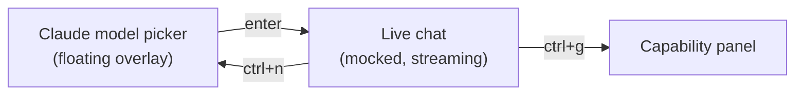

# tuikit-demo

A self-contained example chat TUI built **entirely from the reusable public
packages** under `github.com/cullenmcdermott/sandbox/tui`. It imports nothing
from `internal/` — so it doubles as a starting point any other Bubble Tea app can
copy.

```bash
go run ./cmd/tuikit-demo
```

## The flow



All assistant responses are **mocked** (`replies.go`), but the streaming, tool
cards, spinner, theme-swapping, and the context gauge are real component code.
Pasting works (bracketed paste), and saying *"show me a kitty image"* pops a real
Kitty-graphics cat.

## Keys

| Key | Action |
|---|---|
| ↑/↓, enter | pick a model / scroll the transcript |
| type + ↵ | send a message |
| `ctrl+t` | cycle theme (Midnight / Daylight / Ember) |
| `ctrl+g` | show the terminal-capability panel |
| `ctrl+n` | reopen the model picker |
| `ctrl+c` | quit |

## What each package does here

| Package | Where it shows up |
|---|---|
| `tui/theme` | every color (semantic tokens), `GradientText` wordmark, `SpinnerFrame`, status glyphs, the brand **mark**, and the `OnChange` re-skin on theme swap |
| `tui/kit` | `Card` (tool cards, input box), `Badge`, `KbdRow`, `SectionHeader`, `TitledRule` (picker/caps titles), `Scrollbar`, `FormatTokens` |
| `tui/list` | the virtualized, version-cached transcript (`msgItem` / `toolItem` blocks) |
| `tui/anim` | the gated motion `Engine` (idle chat schedules **no** ticks) and `Ellipsis` |
| `tui/terminal` | `Detect()` Ghostty/Kitty/truecolor caps, `OSCProgress` tab signal, and **Kitty graphics** — say *"show me a kitty image"* for a real embedded cat photo (RGBA → APC `_G` → placeholder cells, transmitted via `tea.Raw` since the cell renderer drops APC), with colored block-art as the fallback |

## Files

- `main.go` — model, Bubble Tea wiring, screen dispatch, opaque-frame fill, terminal-signal splicing
- `picker.go` — Claude model picker as a z-ordered floating overlay with a drop shadow
- `chat.go` — transcript items + the mocked turn state machine (think → tool → stream)
- `chat_view.go` — chat layout (header, transcript, status, input, footer)
- `replies.go` — the canned responses
- `kitty.go` — the context block-bar gauge, the cat popup (Kitty image / block-art), and the capability panel
- `catimg.go` + `cat.jpg` — the embedded cat photo, decoded to RGBA for the Kitty image
