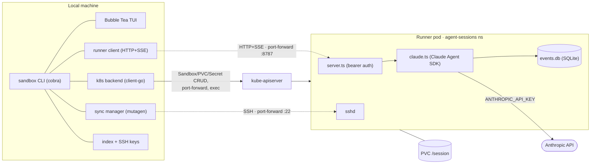

# Architecture

`sandbox` runs interactive AI coding-agent sessions inside Kubernetes pods. It
has two halves that talk over one HTTP+SSE API:

- a **Go CLI** that runs on your laptop (lifecycle, port-forward, TUI, file sync), and
- a **TypeScript runner** that runs one session per pod (Claude Agent SDK, event log, sshd).

The PVC behind each pod is the source of truth for session state, so a session
survives detach, suspend/resume, and CLI restarts.

> **Status:** the component boundaries and the auth/env wiring are implemented
> and unit-tested. The end-to-end file-sync path (Mutagen over SSH) and the
> runner image build have **not** yet been validated on a live cluster — see
> [Unvalidated paths](#unvalidated-paths).

## Components

| Where | Package / file | Role |
|---|---|---|
| Local | `internal/cli` | Cobra command tree; composes backend + runner client + sync |
| Local | `internal/tui` | Bubble Tea v2 TUI: transcript, tool cards, permission modal |
| Local | `internal/k8s` | `Backend`: Sandbox/PVC/Secret CRUD, suspend/resume, port-forward, exec |
| Local | `internal/runner` | HTTP+SSE client implementing `RunnerClient` |
| Local | `internal/sync` | Mutagen manager, SSH keypair + per-session ssh-config alias |
| Local | `internal/index` | Local session index + SSH key storage under `~/.local/share/sandbox` |
| Local | `internal/session` | Shared contract: `Spec`, `State`, `Event`, `Backend`, `RunnerClient` |
| Pod | `runner/src/server.ts` | node:http server, bearer auth, routes (see `runner-api.md`) |
| Pod | `runner/src/claude.ts` | Claude Agent SDK `query()`, hooks, permission flow, event mapping |
| Pod | `runner/src/events.ts` | SQLite event log; append-before-stream; SSE replay |



## Session lifecycle (`sandbox claude`)

```mermaid
sequenceDiagram
    actor U as User
    participant CLI as sandbox CLI
    participant K as kube-apiserver
    participant R as runner pod
    participant M as mutagen

    U->>CLI: sandbox claude "prompt"
    CLI->>CLI: ensure local SSH keypair
    CLI->>K: create Secret (token + ssh pubkey), PVC, Sandbox
    K-->>R: schedule pod (PVC mounted, env injected)
    CLI->>K: wait for pod ready
    CLI->>K: port-forward :8787 and :22
    CLI->>R: GET /healthz
    CLI->>K: read RUNNER_TOKEN from Secret
    CLI->>M: write ssh alias + mutagen sync create
    M-->>R: sync project into /session/workspace (SSH)
    CLI-->>U: open TUI
    U->>CLI: submit prompt
    CLI->>R: POST /sessions/:id/turns (Bearer token)
    R->>R: Claude Agent SDK query()
    R-->>CLI: SSE events (transcript, tools, permissions)
    CLI-->>U: render transcript
    Note over U,R: Ctrl+] detaches; pod + PVC persist.<br/>`sandbox attach` re-forwards and replays from last seq.
```

## State & storage

**In the pod (PVC mounted at `/session`):**

```
/session/state/sandbox/session.json   session state (mutable)
/session/state/sandbox/events.db      SQLite append-only event log (replay source)
/session/state/sandbox/audit.jsonl    PostToolUse audit entries
/session/state/sandbox/outputs/       generated output files
/session/state/claude/                CLAUDE_CONFIG_DIR
/session/workspace/<project path>     cwd handed to the SDK (mirrors host path)
```

**Cluster Secrets:**

| Secret | Keys | Owner | Notes |
|---|---|---|---|
| `<session-id>-runner` | `runner-token`, `ssh-authorized-key` | CLI (per session) | created on `claude`, deleted on `destroy` |
| `anthropic-credentials` | `api-key` | operator (shared) | provisioned out-of-band; referenced **optionally** |

**Local (`~/.local/share/sandbox/`):**

```
remote-sessions/<id>/session.json     local index entry
remote-sessions/<id>/id_ed25519(.pub) per-session SSH keypair
ssh/config                            per-session Host aliases (Include'd from ~/.ssh/config)
```

## Auth & secrets flow

- **Runner API auth.** The CLI generates a 256-bit token at create time, stores
  it in `<session-id>-runner`, and injects it into the pod as `RUNNER_TOKEN` via
  `secretKeyRef`. The same value is read back from the Secret for `claude`,
  `attach`, and `cancel`. The runner rejects every non-`/healthz` request without
  it.
- **Model auth.** `ANTHROPIC_API_KEY` is injected from the shared
  `anthropic-credentials` Secret (optional ref, so the pod still starts before
  it exists; turns fail to authenticate until it does).
- **Sync auth.** The CLI generates a per-session ed25519 keypair; the public key
  rides in the session Secret and is installed as the pod's `authorized_keys`,
  the private key stays local and is referenced by the ssh-config alias. Mutagen
  logs in as root over the port-forward (key only).

## File sync

Mutagen runs three session groups (see `internal/sync`):

1. **project** — local repo ⇄ `/session/workspace/<path>` (two-way-safe),
2. **config inputs** — `~/.claude/{skills,agents,commands,hooks}` → pod (one-way), and
3. **transcripts** — pod `~/.claude/{projects,todos,tasks}` → local (one-way).

Transport is the system `ssh`, configured through a per-session `Host
sandbox-<id>` block (`internal/sync/ssh.go`) pointing at the ephemeral
`127.0.0.1:<port>` port-forward with the per-session identity and
`StrictHostKeyChecking no` (the host is always a fresh local forward; the
per-session key is the auth boundary). `attach` rewrites the alias with the new
port, and Mutagen self-heals on its next reconnect.

## Event model

`internal/session/event.go` (Go) and `runner/src/types.ts` (TypeScript) define
the **same** 23 event variants by hand. The runner maps Claude SDK messages into
these normalized events, persists them to `events.db`, then streams them via SSE;
the CLI consumes the stream with `after=<seq>` replay.

> **Maintenance hazard:** the two definitions are kept in sync manually with no
> codegen and no drift test. Changing one without the other will silently break
> event decoding. A cross-language fixture/golden test is a worthwhile follow-up.

## Security model

- **No cluster credentials in the pod:** `automountServiceAccountToken: false`.
- **Network:** default-deny ingress; egress allows DNS + public 80/443 only —
  RFC1918, CGNAT/tailnet, and link-local/metadata ranges are excluded, so a
  session cannot reach the API server, in-cluster services, or `169.254.169.254`
  (`k8s/agent-sessions/networkpolicy.yaml` in the homelab repo).
- **Pod hardening:** `seccompProfile: RuntimeDefault`; namespace is PodSecurity
  Admission `baseline` enforce / `restricted` warn. The runner currently runs as
  **root** (sshd + single-uid workspace ownership); moving to non-root +
  `fsGroup` + capability drops is a tracked follow-up.
- **Tool guardrails:** the runner's PreToolUse hook blocks host/cluster/credential
  Bash patterns (defense-in-depth, not a boundary), and PostToolUse writes an
  audit log.

## Unvalidated paths

These are implemented but not yet exercised on a real cluster (tracked
separately):

- Building the runner image (`runner/entrypoint.sh`, `ssh-keygen -A`, key-only
  root login) and confirming sshd starts.
- The full turn round-trip (token auth + model response) against a live runner.
- Mutagen actually syncing over the SSH port-forward (root login, agent install),
  including `attach` re-sync and `sandbox sync --pause/--resume/--terminate`.
- Container-level hardening (non-root, `fsGroup`, dropped capabilities) without
  breaking sshd privilege separation.

## See also

- `docs/runner-api.md` — the HTTP+SSE contract between the halves.
- `CLAUDE.md` — repository orientation and toolchain notes.
- `README.md` — prerequisites and quickstart.
