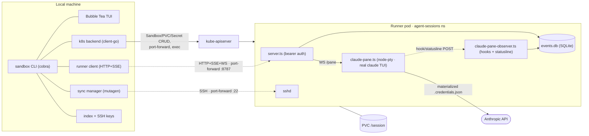

# Architecture

`sandbox` runs interactive AI coding-agent sessions inside Kubernetes pods. It
has two halves that talk over one HTTP+SSE API:

- a **Go CLI** that runs on your laptop (lifecycle, port-forward, TUI, file sync), and
- a **TypeScript runner** that runs one session per pod (agent supervisor +
  observer, event log, sshd).

The PVC behind each pod is the source of truth for session state, so a session
survives detach, suspend/resume, and CLI restarts.

> **Status:** implemented and unit-tested; the end-to-end path — runner image
> build, live turn round-trip, and Mutagen-over-SSH sync — was validated on a
> real cluster 2026-06-23 (see `docs/archive/done-log-2026-06.md`) and the
> runner/reaper images publish to GHCR via `.depot/workflows/`. The
> claude-pane-first path (2026-07-20) is unit/e2e-tested but awaits its live
> cluster pass — see "Unvalidated paths" below.

## Components

| Where | Package / file | Role |
|---|---|---|
| Local | `internal/cli` | Cobra command tree; composes backend + runner client + sync; idle-reaper Job (`reap.go`) |
| Local | `internal/tui/dashboard` | Bubble Tea v2 command-center: session list, attention routing, read-only activity feed, external PTY pane (opencode child process / claude-pane WebSocket) |
| Local | `internal/k8s` | `Backend`: Sandbox/PVC/Secret CRUD, suspend/resume, port-forward, exec; reaper Job spec (`reaper.go`) |
| Local | `internal/runner` | HTTP+SSE client implementing `RunnerClient` (active + passive streams) |
| Local | `internal/sync` | Mutagen manager, SSH keypair + per-session ssh-config alias |
| Local | `internal/index` | Local session index + SSH key storage under `~/.local/share/sandbox` |
| Local | `internal/session` | Shared contract: `Spec`, `State`, `Event`, `Backend`, `RunnerClient` |
| SDK   | `client/models` | Resolves a model's context-window limit + per-million-token pricing; drives the TUI ctx% indicator; importable by external consumers |
| Local | `internal/authstatus` | Offline per-agent auth-status report behind `sandbox auth status` (Claude/Codex/OpenCode providers) |
| SDK   | `client/`, `client/cred` | Public Go SDK (create/connect/suspend/destroy/turns/events/sync) the CLI + TUI dogfood; `client/cred` is the multi-account Anthropic credential store. New capability lands here first |
| SDK   | `tui/` | Public, importable TUI building blocks split out of the dashboard: `tui/kit`, `tui/anim`, `tui/list`, `tui/picker`, `tui/theme`, `tui/composer`, `tui/chrome`, `tui/terminal` |
| Test  | `sdktest/` | Separate Go module that imports `client`/`client/cred` as an external consumer — compile-time signature pins + behavioral contract tests (`just sdk-conformance`) |
| Test  | `internal/k8sit` | Build-tagged two-layer integration tests (CLI→controller→pod) incl. the backend-conformance `backendCases` harness |
| Test  | `internal/e2e` | Build-tagged (`//go:build e2e`) CLI↔runner smoke test: a full turn across the `internal/runner` HTTP+SSE seam against an in-process fake runner |
| Pod | `runner/src/server.ts` | node:http server, bearer auth, routes incl. the pane WebSocket + observer ingestion (see `runner-api.md`) |
| Pod | `runner/src/claude-pane.ts` | claude-pane supervisor: lazy node-pty spawn of the real `claude` TUI (`--session-id`/`--resume`), scrubbed env allowlist, scrollback ring, child-exit recording |
| Pod | `runner/src/claude-pane-observer.ts` | Observer: provisioned command hooks + statusline POST to localhost; maps them to normalized turn/message/tool/permission/usage events |
| Pod | `runner/src/claude-config.ts` | Boot materialization of the pane's auth/state: `.credentials.json`, `.claude.json` seed, settings merge (hooks, statusline, native-sandbox-off), helper scripts |
| Pod | `runner/src/bootstrap.ts` | Boot materialization of operator `BootstrapFiles` (part A) from the mounted `SANDBOX_BOOTSTRAP_DIR` Secret volume into `$HOME`/`/session/state`, before any agent starts; write-if-changed with a per-file seed-hash sidecar |
| Pod | `runner/src/guards.ts` | Shared Bash blocklist enforced by `/exec` and the generated opencode guard plugin |
| Pod | `runner/src/grants.ts` | Session-scoped permission grants (retained for the opencode turn path) |
| Pod | `runner/src/auth.ts` | Constant-time bearer-token gate for every non-`/healthz` route |
| Pod | `runner/src/opencode.ts` | OpenCode backend: supervises `opencode serve` for `sandbox opencode` sessions |
| Pod | `runner/src/opencode-turn.ts` | OpenCode turn adapter: drives a one-shot turn via the `opencode serve` HTTP API (@opencode-ai/sdk), mapping its events into the normalized model |
| Pod | `runner/src/opencode-observer.ts` | Second-client observer that surfaces interactive opencode turns as normalized busy/idle + events |
| Pod | `runner/src/codex.ts` / `codex-observer.ts` | Codex backend: supervises `codex app-server` (pod-loopback websocket :8788) and observes its turns as normalized events |
| Pod | `runner/src/events.ts` | SQLite event log; append-before-stream; SSE replay |

There are **three agent backends**, all supervised by the runner (the metrics
source for every backend — the agent parity bar):

- **`claude-pane`** (the default for `sandbox claude`, claude-pane-first): the
  runner spawns the real Claude Code TUI under node-pty and owns the PTY for
  the pod lifetime; the CLI attaches over a WebSocket
  (`GET /sessions/:id/pane`) through the existing 8787 forward. Programmatic
  turns, permission resolution, and autopilot were removed with the SDK
  engine — interaction happens in-pane; the observer (provisioned hooks +
  statusline) feeds the normalized event stream for the dashboard/feed.
- **`opencode-server`**: a supervised `opencode serve` process. Accepts the
  one-shot headless first turn through `POST /turns` (`opencode-turn.ts`); the
  interactive `sandbox opencode` PTY pane attaches to that same process as a
  local child, observed by `opencode-observer.ts`.
- **`codex-app-server`**: a supervised `codex app-server` process
  (pod-loopback websocket :8788) with observer-sourced events; the interactive
  pane rides the same transport seam as claude-pane in a later phase (see
  `docs/backend-conformance.md`).

The idle reaper is a per-session Kubernetes Job that polls the runner's `/idle`
and suspends the Sandbox (replicas→0) after the idle timeout; pane attaches
count as external activity, and the observers drive synthetic busy between
turn.started and Stop.



## Session lifecycle (`sandbox claude`)

```mermaid
sequenceDiagram
    actor U as User
    participant CLI as sandbox CLI
    participant K as kube-apiserver
    participant R as runner pod
    participant M as mutagen

    U->>CLI: sandbox claude
    CLI->>CLI: ensure local SSH keypair + resolve full Claude credential (SystemMaterial)
    CLI->>K: create Secret (token + ssh pubkey + credential docs), PVC, Sandbox
    K-->>R: schedule pod (PVC mounted, env injected)
    R->>R: materialize .credentials.json + .claude.json seed + settings/hooks
    CLI->>K: wait for pod ready
    CLI->>K: port-forward :8787 and :22
    CLI->>R: GET /healthz
    CLI->>K: read RUNNER_TOKEN from Secret
    CLI->>M: write ssh alias + mutagen sync create
    M-->>R: sync project into the host project path (SSH)
    CLI-->>U: open TUI
    U->>CLI: attach (enter)
    CLI->>R: WS GET /sessions/:id/pane (Bearer token)
    R->>R: lazy-spawn claude under node-pty (--session-id / --resume)
    R-->>CLI: scrollback replay + live PTY bytes (keystrokes go back up)
    R-->>CLI: SSE events in parallel (observer: turns, tools, permissions, usage)
    CLI-->>U: real Claude Code TUI in the pane; dashboard/feed from SSE
    Note over U,R: Ctrl+] detaches; the claude child keeps running.<br/>`sandbox attach` re-forwards, replays the pane scrollback,<br/>and resumes SSE from the last seq.
```

## State & storage

**In the pod (PVC mounted at `/session`):**

```
/session/state/sandbox/session.json   session state (mutable)
/session/state/sandbox/events.db      SQLite append-only event log (replay source)
/session/state/sandbox/audit.jsonl    PostToolUse audit entries
/session/state/sandbox/outputs/       generated output files
/session/state/claude/                CLAUDE_CONFIG_DIR
/session/workspace/<workspace path>   workspace files in the PVC (legacy /session view)
<workspace path>                      the same files, bind-mounted at the real host path
                                      via subPath — this is the cwd handed to the agent, so
                                      transcripts land in CLAUDE_CONFIG_DIR/projects/<host path>.
                                      <workspace path> = Spec.WorkspacePath (the per-session
                                      git worktree when one exists, else the repo root), NOT
                                      the repo-root Spec.ProjectPath used for grouping/display
```

**Cluster Secrets:**

| Secret | Keys | Owner | Notes |
|---|---|---|---|
| `<session-id>-runner` | `runner-token`, `opencode-password`, `ssh-authorized-key`, `anthropic-credential` (claude account sessions), `codex-auth-json` (codex account sessions), `opencode-auth-json` (seeded opencode sessions) | CLI (per session) | created on `claude`, deleted on `destroy`; the credential key is written only for the matching backend/mode — account-backed claude/codex sessions also get a `sandbox.cullen.dev/{anthropic,codex}-account=<id>` label so rotation/logout can enumerate copies (opencode's seed key is not account-scoped) |
| `anthropic-credentials` | `api-key` (OAuth token), `console-api-key` | operator (shared) | provisioned out-of-band; referenced **optionally**; fallback when no account is chosen |

**Local (`~/.local/share/sandbox/`):**

```
remote-sessions/<id>/session.json     local index entry
remote-sessions/<id>/id_ed25519(.pub) per-session SSH keypair
remote-sessions/ssh/config            per-session Host aliases (Include'd from ~/.ssh/config);
                                      lives INSIDE the state dir so a WithStateDir consumer
                                      keeps every artifact under one root (a best-effort
                                      one-time migration moves it in from the old sibling
                                      location dir(stateDir)/ssh and rewrites the Include)
remote-sessions/worktrees/<id>/       per-session git worktree on branch sandbox/<id>, created
                                      at session create for git projects (--worktree auto|on —
                                      see docs/session-lifecycle.md)
anthropic-accounts.json               Anthropic account metadata + default id (never secret bytes)
anthropic-secrets/                    per-account 0600 secret files (file backend only; macOS
                                      uses the Keychain, service "sandbox-anthropic")
```

## Auth & secrets flow

- **Runner API auth.** The CLI generates a 256-bit token at create time, stores
  it in `<session-id>-runner`, and injects it into the pod as `RUNNER_TOKEN` via
  `secretKeyRef`. The same value is read back from the Secret for `claude`,
  `attach`, and `cancel`. The runner rejects every non-`/healthz` request without
  it.
- **Model auth (claude-pane backend).** The pane runs the real Claude Code
  binary, so it authenticates like Claude Code — from full credential
  documents, never an env token (an env `CLAUDE_CODE_OAUTH_TOKEN` forces
  degraded "Claude API" mode; a pane pod is **never** given one):
  - At create time the CLI resolves the **full claudeAiOauth credential**:
    by default `cred.SystemMaterial` — the host's own Claude Code login
    (macOS Keychain item `Claude Code-credentials` / `.credentials.json`,
    plus `.claude.json`'s `oauthAccount`) — the Max-mode path; or, with
    `--account`, the stored setup token (`ProvisionMaterial`, a documented
    degraded fallback). Fail-closed: no resolvable material aborts the create
    (`ErrClaudePaneCredentialMissing`); there is no shared-Secret fallback.
  - The documents ride the per-session Secret (`claude-credentials-json`,
    `claude-oauth-account-json`) into the pod as required-ref envs, and the
    runner **materializes** them on boot, idempotently and only-if-absent:
    `$CLAUDE_CONFIG_DIR/.credentials.json`, the `.claude.json` seed
    (onboarding + workspace trust), the settings merge (observer hooks,
    statusline, native-sandbox-off), and the helper scripts
    (`runner/src/claude-config.ts`). In-pod claude refreshes tokens against
    the PVC copy; the host store copy diverges (accepted single-user scope).
- **Model auth (other backends).** `opencode-server` and `codex-app-server`
  keep their own credential contracts (`ANTHROPIC_API_KEY` /
  `OPENAI_API_KEY` / ChatGPT-OAuth `auth.json`), per-session-Secret-backed
  with fail-closed account selection, or the shared operator Secrets as the
  legacy fallback (see `buildEnv` in `internal/k8s/backend.go`).
- **Operator injection (SDK).** `CreateOptions.ExtraEnv`/`ExtraSecretEnv`
  (part B) inject plain + Secret-backed env, and `CreateOptions.BootstrapFiles`
  (part A) inject operator files. Both are create-time-only material
  (`json:"-"`), validated fail-closed at the client (reserved-name denylist /
  size cap for env; path-inside-`$HOME`-or-`/session/state`, no `..` escape,
  256 KiB cap for files). Files ride the per-session Secret as `bootstrap-<n>`
  keys + a `bootstrap-manifest`, projected read-only as a Secret volume
  (`SANDBOX_BOOTSTRAP_DIR`); the runner materializes them at boot **before any
  agent starts** (`bootstrap.ts`, the shared materialize step beside the codex
  seed), write-if-changed so a restart keeps an agent's in-place edit unless the
  operator rotated the seed. See `docs/design-pod-bootstrap-and-tool-injection.md`.
- **Sync auth.** The CLI generates a per-session ed25519 keypair; the public key
  rides in the session Secret and is installed as the pod's `authorized_keys`,
  the private key stays local and is referenced by the ssh-config alias. Mutagen
  logs in as root over the port-forward (key only).

## File sync

Mutagen runs three session groups (see `internal/sync`):

1. **project** — local workspace ⇄ the pod's `<workspace path>` (the real host
   path the workspace subtree is bind-mounted at, two-way-safe; both endpoints
   are `Spec.WorkspacePath` — the per-session worktree when one exists, else
   the repo root),
2. **config inputs** — `~/.claude/{skills,agents,commands,hooks,statusline}` →
   pod (one-way; `statusline/user-statusline` is the host-provided executable
   the claude pane's provisioned statusline chains to — a sibling of the
   runner-owned `pane-observer/` dir so host sync can never touch the observer
   token), and
3. **transcripts** — pod `/session/state/claude/{projects,todos,tasks}`
   (`CLAUDE_CONFIG_DIR`) → local `~/.claude/{projects,todos,tasks}` (one-way).

Transport is the system `ssh`, configured through a per-session `Host
sandbox-<id>` block (`internal/sync/ssh.go`) pointing at the ephemeral
`127.0.0.1:<port>` port-forward with the per-session identity and
`StrictHostKeyChecking no` (the host is always a fresh local forward; the
per-session key is the auth boundary). `attach` rewrites the alias with the new
port, and Mutagen self-heals on its next reconnect.

## Event model

`schema/events.json` is the **single source of truth** for the normalized event
model (the event-type strings + the payload field shapes). The runner's backend
observers map their native signals (claude-pane hooks/statusline, opencode SSE,
codex app-server) into these events, persist them to `events.db`, then stream
them via SSE; the CLI consumes the stream with `after=<seq>` replay.

Both languages are kept honest against the schema:

- **TypeScript is generated.** `cmd/gen-eventschema` emits `runner/src/events.gen.ts`
  (the `EventType` union, `ALL_EVENT_TYPES`, and every payload `interface`).
  `runner/src/types.ts` re-exports them; never hand-edit a `*.gen.ts` file.
- **Go is generated + validated.** The same generator emits the `EventType` consts
  and `AllEventTypes` to `internal/session/eventtypes.gen.go`. The payload *structs*
  stay hand-written in `event.go` (so Go keeps `*int`/`omitempty` nuances) but
  `internal/session/schema_test.go` reflects over them and fails if any field's
  json tag, coarse type, or `omitempty` drifts from the schema.

**Workflow:** edit `schema/events.json`, run `just gen`, commit the regenerated
files. CI's generated-file diff gate fails on a schema change that wasn't
regenerated (or a hand-edited `*.gen.*`), and the Go drift test fails on a struct
that diverges. Scope is event payloads only — HTTP request/response bodies and
`IdleStatus` stay hand-written in both languages.

Since claude-pane-first (protocolVersion 3) the vocabulary is pruned to what
the observers actually produce: the SDK-engine types (`autopilot.state`,
`models.available`, `todo.updated`, `tool.delta`, `tool.progress`) are gone;
`workspace.status` and `context.compacted` remain with live Go consumers but
no current producer (observers can re-emit them). The server-side autopilot
driver was removed with the SDK engine — the revival path is headless
`claude -p --resume` (see `docs/archive/server-side-loop-adr.md` for the
retired design).

## Observability (`SANDBOX_TRACE`)

Dependency-free timing spans, off by default, enabled by setting
`SANDBOX_TRACE` (the CLI's `--trace` flag sets it host-side; the pod env must
set it runner-side). Each side emits one greppable line per span:

- **CLI connect/create phases** (`client/trace.go`): every phase of
  Connect/Create — status probe, pod-ready wait, port-forward, runner health,
  project sync, plus the backgrounded flush/inputs/reaper — under one short
  flow id (`trace: 3f9a1c2b connect.port_forward 412ms`), written to stderr.
- **Runner turn lifecycle** (`runner/src/trace.ts`): first message, first
  delta, settled + message count, keyed by turn id, written to the pod log.
- **Runner boot phases** (`runner/src/index.ts`): event-log open, session-state
  load, registry init, boot prep, socket listen, plus a total, keyed `boot`.
- **The bridge:** the Go runner client stamps the connect flow id on requests
  as `X-Sandbox-Trace-Id`; on `POST /turns` the runner logs
  `trace: <flowId> turn.link turn=<turnId>` — so in merged CLI+pod logs one
  grep for either id pivots to the other. See `docs/runner-api.md`.

Not yet traced: pod-ready sub-phases (schedule vs image-pull vs ready — the
big §5 unknown) and SSE first-event latency (TODO §10).

## Security model

- **No cluster credentials in the pod:** `automountServiceAccountToken: false`.
- **Network:** default-deny ingress; egress allows DNS + public 80/443 only —
  RFC1918, CGNAT/tailnet, and link-local/metadata ranges are excluded, so a
  session cannot reach the API server, in-cluster services, or `169.254.169.254`
  (see the example manifests in this repo, `k8s/networkpolicy-default-deny.yaml`
  + `k8s/networkpolicy-egress-allow.yaml`; the maintainer's real cluster wiring
  is a separate private deployment). Be clear about what this is: a
  **lateral-movement boundary, not an exfiltration one**. Agents need the public
  internet to work, so a compromised or prompt-injected agent can POST anything
  it can read to any public host on 443. Exfil control is limited to what never
  reaches the pod — the file-sync ignore boundary below.
- **File-sync boundary (laptop↔pod):** the project sync's ignores layer in
  mutagen later-wins precedence order: large build trees (overridable), the
  project root's **`.gitignore`** translated verbatim to `--ignore` flags (what
  you keep out of git stays off the pod), then a **non-overridable** final
  layer — secret patterns (`.env`, `.env.*`, `*.pem`, `*.key`, `*.p12`,
  `*.pfx`) plus files that auto-execute on the host if the pod agent writes
  them and two-way sync carries them back (`.envrc`, `.direnv`, `.vscode`,
  `.idea`). Nested `.gitignore` files and git's global excludesFile are not
  consulted. See `internal/sync/sync.go` + `internal/sync/gitignore.go`.
- **Pod hardening:** `seccompProfile: RuntimeDefault`; namespace is PodSecurity
  Admission `baseline` enforce / `restricted` warn. The container `securityContext`
  drops **all** capabilities, then re-adds only the default runtime set sshd's
  privilege separation and the agent need (CHOWN, SETUID/SETGID, NET_BIND_SERVICE,
  …) — notably **without** NET_RAW or MKNOD — and sets
  `allowPrivilegeEscalation: false` (BR1). The runner still runs as **root**
  (sshd + single-uid workspace ownership); moving to non-root + `fsGroup` is a
  tracked follow-up (M20).
- **Tool guardrails:** the k8s pod is the isolation boundary for every
  backend; in-pod guardrails are defense-in-depth, not a boundary. The shared
  Bash blocklist (`runner/src/guards.ts`) is enforced by `/exec` and, for
  opencode — whose tools run inside the un-proxied `opencode serve` process —
  by a guardrail plugin the runner generates at boot and registers in the
  opencode config's `plugin` array; its `tool.execute.before` hook throws to
  block a match, and every opencode tool execution is audited to
  `audit.jsonl` (fail-open: a plugin-install failure logs loudly but never
  blocks `opencode serve`). The claude pane runs Claude Code's own permission
  system interactively (native OS sandbox disabled — the pod is the sandbox,
  and native-sandbox auto-approval would suppress the permission hooks the
  observer needs); its tool use is audited to `audit.jsonl` via the
  observer's PreToolUse hook, which is deliberately observational (always
  exits 0 — telemetry may never block the interactive session).

## Unvalidated paths

These are implemented but not yet exercised on a real cluster (tracked in
`openspec/changes/claude-pane-first/tasks.md`, maintainer-pending):

- The runner image build with the pinned claude binary + node-pty
  (`.depot/workflows/build-runner-image.yml`, task 1.4).
- claude-pane live validation: fresh session reaches the composer with zero
  dialogs in Max mode; attach → work → detach mid-turn → feed → suspend →
  resume → reattach continuity (tasks 2.5 / 8.2).
- Credential-refresh rotation observation on a throwaway session (task 8.3;
  gates multi-account polish, not the change).
- Container-level hardening (non-root + `fsGroup`; capability drops already
  landed in BR1) without breaking sshd privilege separation (pre-existing
  follow-up M20).

## See also

- `docs/runner-api.md` — the HTTP+SSE contract between the halves.
- `CLAUDE.md` — repository orientation and toolchain notes.
- `README.md` — prerequisites and quickstart.
