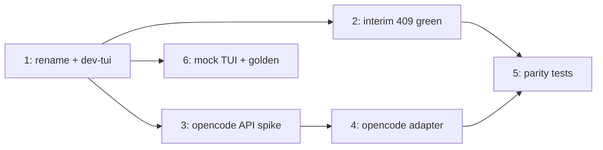

# Plan: local dev loop + cross-backend one-shot turn parity

## Context

The local KIND dev environment and two-layer integration tests now exist and the
plumbing is proven end-to-end (CLI → agent-sandbox controller → Sandbox CRD →
runner pod → port-forward → runner HTTP). The live run surfaced one hard fact:

- The runner's `POST /sessions/:id/turns` + SSE `/events` seam (driven by the new
  headless `sandbox turn` command and the integration tests) is **claude-sdk
  only**. For `opencode-server` the runner returns `409 "backend opencode-server
  does not accept runner turns"` *by design* — opencode turns are driven by the
  local `opencode attach` client talking straight to the in-pod `opencode serve`
  (:4096); the runner supervises that process but does not proxy turns
  (`runner/src/opencode.ts`, `runner/src/server.ts:138-143`).

This plan closes that gap and builds the surrounding dev ergonomics. The key
enabler already exists: `runner/src/agent.ts` defines the `Agent` interface
(`runTurn(...)` → normalized events via `appendEvent`) and `selectAgent()`
dispatches by backend. claude-sdk implements it; opencode returns `null`. So a
**shared one-shot turn interface across agents is not new architecture — it is
finishing an adapter** that already has a slot (the same slot Codex will use).

### Decisions captured
- opencode turn tests use a **free opencode model** (cost-safe).
- Prefer the **official opencode SDK** (`@opencode-ai/sdk`) over a hand-rolled
  HTTP/SSE client in the runner.
- Rename `dev/local` → `dev/local`; drop "lab" wording (cluster `sandbox-local` →
  `sandbox-local`, context `kind-sandbox-local`).
- Default `kind-test` stays **free** (plumbing + gate assertions, zero model
  calls); real model turns are an explicit opt-in recipe.

### Already built (do not rebuild — adapt under the rename)
- `dev/local/**` (kind.yaml, Tiltfile, README, secret-template, vendored
  agent-sandbox v0.4.6 `manifest.yaml` + VERSION, `manifests/{namespace,
  agent-reaper}.yaml`)
- `internal/cli/turn.go` (+ registration in `root.go`) — headless `sandbox turn`
- `internal/k8sit/{lab_test.go,backend_test.go,cli_smoke_test.go}` (build tag
  `integration`, context-isolation guard)
- `justfile` recipes `kind-up`/`kind-down`/`dev-image`/`kind-test` (out of `check`)
- `.envrc` + `.flox` (kind/tilt/kubectl/helm/cri-tools), `Dockerfile.reaper`
  `TARGETARCH` fix, `.dockerignore`

---

## Sequenced phases

Ordering rationale: do the **rename first** (everything downstream references the
new paths), keep the suite **green at every step**, gate the opencode adapter on a
short **API spike**, then layer the parity tests and the mock TUI suite.

### Phase 1 — Local dev ergonomics + rename (item 4) — **S**

Rename and add the dev loop so the new paths are settled before the bigger work.

- Rename `dev/local/` → `dev/local/`; update every reference: `justfile`,
  `dev/local/Tiltfile`, `dev/local/README.md`, `.gitignore`
  (`dev/local/secret.local.yaml`, `dev/local/.kubeconfig`), `agent-sandbox/VERSION`.
- Cluster `sandbox-local` → `sandbox-local` ⇒ context `kind-sandbox-local`. Update
  the k8sit guard constant (`localContext`) and rename the "lab" helpers/file
  (`lab_test.go` → `local_test.go`, `localRestConfig` → `localRestConfig`, etc.).
- Recipes: keep `kind-up`/`kind-down`; rename `dev-image` → `dev-image`;
  `kind-test` stays. Add:
  - `dev-up` — `kind-up` + `dev-image` in one shot.
  - `dev-tui backend=<claude|opencode>` —
    `KUBECONFIG=dev/local/.kubeconfig go run ./cmd/sandbox {{backend}}
    --runner-image sandbox-runner:dev --reaper-image sandbox-reaper:dev`
    (self-activates flox; `go run` = no install step). This is the "dev CLI →
    dev TUI at the local cluster" loop.
- **Verify:** `just dev-up && just dev-tui backend=claude` launches the real TUI
  against the local cluster; `just kind-test` still green; `just check` unchanged.
- **Open check (flag, don't block):** the TUI also starts Mutagen file-sync over
  SSH to the pod. Port-forward + turns are proven on KIND; sync is unverified.
  Confirm sync works on KIND, or surface a graceful degrade / `--no-sync` path.

### Phase 2 — Make `kind-test` green against today's reality (interim) — **S**

Before the adapter lands, stop the suite failing on the (correct) 409.

- In the opencode backend test, assert the **expected 409** ("does not accept
  runner turns") as the current, documented opencode behavior — proving the full
  infra chain + correct gating. Mark clearly as **interim**: Phase 4 flips this to
  a real turn assertion once the adapter exists.
- **Verify:** `just kind-test` passes (opencode = infra+409, claude = plumbing).

### Phase 3 — opencode server API spike (gate for Phase 4) — **S**

De-risk the one unknown: opencode 1.17.7's server API + event model.

- Stand up `opencode serve` (1.17.7) — locally or a throwaway pod — and confirm,
  against the real thing: create/resolve a session; send a prompt with model
  selection; subscribe to the event/SSE stream; the event shapes for assistant
  text, tool call/result, completion/idle, and errors.
- Confirm `@opencode-ai/sdk` exists for 1.17.7 and its surface
  (`createOpencodeClient`, `session.prompt`, `event.subscribe`, model params).
- **Output:** a mapping table `opencode event → normalized event` (the
  `schema/events.json` set) and a go/no-go on the SDK. This is the input to
  Phase 4.

### Phase 4 — opencode one-shot turn adapter (item 1) — **M**

Implement the `Agent` interface for opencode so both backends share the runner
turn seam.

- Add `@opencode-ai/sdk` to `runner/package.json` (official client; no
  hand-rolling).
- New `runner/src/opencode-turn.ts` implementing
  `Agent.runTurn(cfg, turnId, prompt, resume, allowedTools, mode, model, abort)`:
  ensure `opencode serve` is up (supervisor already guarantees this) → create/
  reuse an opencode session → subscribe to its event stream → send the prompt
  (model from `TurnInput.Model` or the configured default free model) → map each
  opencode event to `appendEvent(...)` normalized events → handle `abort` → call
  `finishTurn` on idle/completion. Mirror `runner/src/claude.ts` / `mapping.ts`
  for the event-emission contract.
- Wire `selectAgent('opencode-server') → opencodeAgent` in `agent.ts`; remove the
  `null`/409 branch in `server.ts`. Keep the interactive `opencode attach` path
  working — the adapter is additive over the shared supervised `serve`.
- Map what maps; **document gaps honestly** (opencode may not expose the
  permission flow or token accounting → emit best-effort, e.g. `usage.updated`
  with `available:false`; no `permission.*`). Keep the runner's single-active-turn
  (R4) guard in `server.ts`.
- Tests: runner unit test with a mocked opencode SDK/server asserting the event
  mapping (`turn.started → message.* / tool.* → turn.completed/failed`).
- Docs: update `docs/runner-api.md` + `docs/architecture.md` (opencode now
  accepts runner turns); rebuild `sandbox-runner:dev`.
- **Verify:** `sandbox turn <opencode-session> --prompt "say hi"` returns a reply
  (free model) instead of 409.

### Phase 5 — cross-backend turn parity tests (item 2) — **M**

Generalize the suite to prove a one-shot turn on **each** backend, cost-safely.

- Parameterize `internal/k8sit` over a table of
  `{backend, image, model, keySecret}` driving the same
  create→start→health→turn→assert flow (claude-sdk + opencode-server).
- Flip the opencode test from the Phase 2 interim 409 to a real
  `turn.started…message.completed` assertion (free model).
- **Cost control (the core of item 2):**
  - Default `kind-test` = **plumbing-only / no model calls**: claude asserts the
    turn loop reaches the runner + `turn.started`; opencode asserts the same now
    that the adapter exists. Zero spend.
  - Real model turns behind an **opt-in** recipe `just dev-turn` (or
    `K8SIT_REAL_TURN=1`): **one** tiny call per backend — claude = a 3-word haiku
    prompt (gated on `anthropic-credentials`); opencode = a free model. Skips the
    backend when its key/secret is absent.
- **Verify:** `just kind-test` (free) green; `just dev-turn` with secrets present
  yields one real reply per backend; absent → skipped, still green.

### Phase 6 — mock TUI multi-turn + visual validation (item 3) — **M**

Deterministic, free, against a fake runner — the right home for visual checks.

- Build a fake runner (in-process `httptest` serving canned normalized SSE
  events; reuse the `internal/e2e` fake substrate) and drive the dashboard via
  `teatest` (already a dep) through a multi-turn scenario.
- Golden-frame assertions via `x/exp/golden` + `x/vt` (already deps; matches the
  existing `internal/tui/dashboard/golden_test.go` /
  `golden_transcript_test.go`) for visual regression.
- Nice-to-have: a `vhs` tape for human-eyeball gifs.
- Keep it off the cluster (no cost, no flakiness). A real-cluster TUI multi-turn
  stays a rare **manual** smoke, not automated.
- **Verify:** `go test ./internal/tui/dashboard/...` covers a multi-turn render;
  `golden` snapshots update cleanly with `-update`.

---

## Dependencies

- Phase 1 first (settles paths). Phase 3 gates Phase 4. Phase 4 gates the
  opencode half of Phase 5. Phase 6 is independent after Phase 1.

## Risks / unknowns

1. **opencode API shape (1.17.7)** — the main unknown; Phase 3 pins it before any
   adapter code. Mitigated by the official SDK if present.
2. **Event-model gaps** — opencode may not surface permissions/token usage like
   the Claude SDK; the mapping is intentionally lossy and documented, not faked.
3. **Mutagen sync on KIND** — unverified; Phase 1 flags it. Turns work regardless;
   only full file-sync in the dev TUI is at risk.
4. **Free-model availability/limits** — pick a free opencode model that is stable;
   keep real-turn tests opt-in and single-call to stay within limits.

## Out of scope (noted)
- Codex backend adapter (same `Agent` slot; follows once its transport lands —
  see `docs/codex-integration-plan.md`).
- Hall image mirror (deferred; `kind load` carries the lab).
- Real-cluster automated multi-turn TUI / CI integration (local-only for now).
