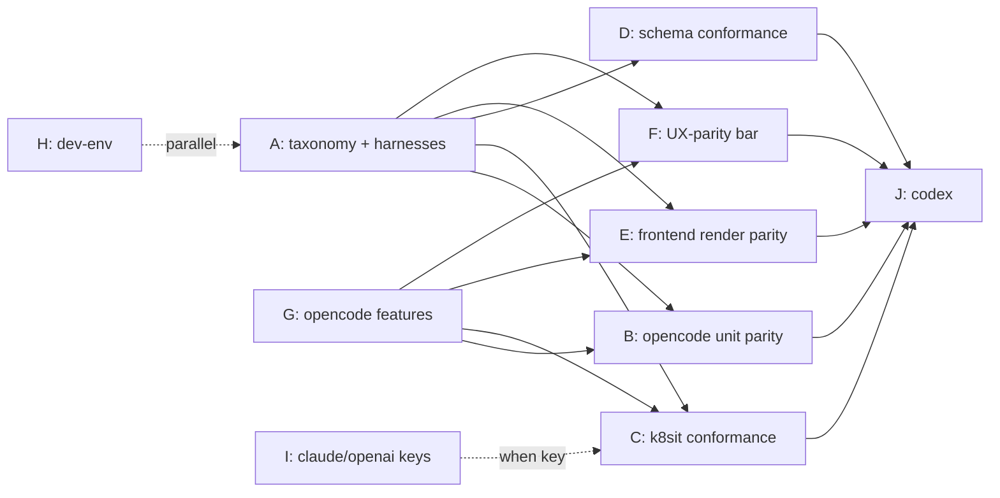

# Plan: frontend + backend testing parity (claude-sdk · opencode · codex)

## Goal

Each agent backend has **two surfaces** that users depend on, and **both** must be
tested in the **same categories** across every backend:

- **Backend surface** — the runner adapter (`Agent.runTurn`, `runner/src/*`) that
  maps a concrete agent (Claude SDK / `opencode serve` / Codex) into the
  **normalized event model** (`schema/events.json`).
- **Frontend surface** — the TUI (`internal/tui/dashboard/*`) that renders those
  events and lets the user drive turns, detach, see metrics, reconnect.

Parity means: for claude-sdk, opencode, and (next) Codex, **both columns of both
matrices below are green**, using **shared, parameterized** tests — so onboarding a
backend is "fill in the column," not "invent a test story." This directly enforces
the agent-parity bar: startup, detach, keybindings, and metrics must be the same
across backends; external-pane backends are not second-class.

## The unifying lever

Every backend now emits the **same normalized events** through the runner
(claude-sdk natively; opencode via the new `opencode-turn.ts` adapter; Codex next).
That single seam is what makes two-surface parity tractable:

```
            ┌─ backend surface (runner adapter) ── tested by: event-mapping +
agent ──►   │                                       turn-conformance + k8sit live
(claude/    │   normalized events (schema/events.json)
 opencode/  │
 codex)     └─ frontend surface (ONE dashboard transcript renderer) ── tested by:
                                                    golden render + interactive +
                                                    UX-parity (status/detach/keys)
```

**Strategic implication:** because opencode (and Codex) now produce normalized
events, they can render through the **same** dashboard transcript as claude-sdk
instead of only an external PTY pane. Routing runner-driven turns through the one
renderer makes frontend parity a **shared renderer test** (drive synthetic events →
golden) rather than per-backend bespoke UI work. The external pane stays as an
optional interactive-only view, explicitly scoped — not the *only* opencode
frontend. Deciding this (Phase E) is the highest-leverage frontend move.

## Where we are — two matrices

Shared infra (backend-agnostic): runner `auth/events/exec/grants/edited-input`;
`schema_test.go`/`types_test.go`; dashboard render/reconnect/statusline helpers.

### Backend conformance (runner adapter)

| Category | claude-sdk | opencode | codex (target) |
|---|---|---|---|
| Event mapping (unit) | ✅ `mapping.test.ts` | ✅ `opencode-turn.test.ts` | ◻️ |
| Turn settle / lifecycle (unit) | ✅ | ✅ | ◻️ |
| Abort / no-double-interrupt (unit) | ✅ | ✅ | ◻️ |
| Hang / deadline safety (unit) | ◻️ implicit | ✅ | ◻️ |
| Model selection | ✅ `model-option` | ✅ unit (`effectiveOpencodeModel` + `parseOpencodeModel`) | ◻️ |
| Permission flow | ✅ `permission*` | ✅ unit (auto-respond, Phase G) | ◻️ |
| Resume / continuity | ✅ `resume` | ✅ unit (`effectiveOpencodeSession`, Phase G) + live | ◻️ |
| Auto-title / crash-recovery | ✅ `session-title`/`session-status` | ❌ | ◻️ |
| Live turn (k8sit) | ✅ plumbing-only (no key) | ✅ real (free) | ◻️ |
| Streaming deltas (unit + live) | ✅ | ✅ unit + live (35 deltas, Phase G) | ◻️ |
| Live interrupt / error-surface / lifecycle ops | ✅ error-surface + lifecycle (interrupt gated on key) | ✅ interrupt + error-surface + lifecycle (Phase C) | ◻️ |
| Reconnect / `after=seq` replay (k8sit) | ✅ `TestBackendReconnectReplay` | ✅ `TestBackendReconnectReplay` | ◻️ |
| Schema conformance of emitted events (per adapter) | ◻️ struct-level | ◻️ struct-level | ◻️ |

### Frontend conformance (TUI)

| Category | claude-sdk | opencode | codex (target) |
|---|---|---|---|
| Transcript render (golden) | ✅ `golden_*`/`transcript_parity` | ❌ (external pane, not rendered by us) | ◻️ |
| Interactive turn (input→submit→StartTurn→render) | ✅ `actions`/`commands`/`modes` | ❌ | ◻️ |
| Adverse-state frames (permission modal / error / plan card) | ◻️ partial | ❌ | ◻️ |
| Status line / metrics parity (ctx% · usage · rate_limit · model · workspace) | ✅ `statusline*` | ✅ cross-backend equality (`TestUXParityStatusLineMetrics`, Phase F) | ◻️ |
| Startup / connecting UX | ✅ `connecting_preview` | ◻️ not per-backend | ◻️ |
| Reconnect / SSE replay UI | ✅ `reconnect_*` | ◻️ not per-backend | ◻️ |
| Detach / keybindings / interrupt UX (the parity bar) | ✅ interrupt + keybindings parameterized (Phase F); detach E-gated | ✅ interrupt + keybindings parameterized (Phase F); detach E-gated | ◻️ |
| External-pane lifecycle (attach/detach/resize/close-reap + chrome) | n/a | ◻️ `external_pane_test` (close/emulator only) | ◻️ |

Legend: ✅ covered · ◻️ partial/implicit/not-parameterized · ❌ missing.
The picture: **claude-sdk is well-covered on both surfaces; opencode's backend
surface is now near-parity but its frontend surface is thin (external pane only);
Codex is empty on both.** Closing the frontend column for opencode is the biggest
gap and the clearest "second-class" risk.

## Gaps (consolidated)

**Backend (runner):**
1. opencode functional gaps: **permission flow**, **resume/continuity**, and
   **streaming deltas** are DONE (Phase G, unit + live). Remaining: **auto-title**
   (`opencode-turn.ts`).
2. ~~k8sit tests only the turn~~ DONE (Phase C): `conformance_test.go` adds live
   **interrupt**, **error-surface (no-wedge)**, **reconnect/`after=seq` replay**, and
   **lifecycle (suspend→resume→turn + destroy idempotency)**, all table-driven over
   `backendCases`. (Remaining: CLI smoke is still opencode-only — make it table-driven.)
3. opencode error/abort paths are now **live-exercised** (Phase C error-surface +
   interrupt). The suite also caught two real bugs (`Backend.Resume` returning early
   on the terminating pod; opencode resume racing `opencode serve` boot) — both fixed.
4. No per-adapter **schema-conformance replay** (only payload structs validated).

**Frontend (TUI):**
5. **opencode has no transcript-render parity** — interactively it's an external
   PTY pane (opencode's own UI), so none of our render/golden coverage applies.
6. **No cross-backend UX-parity tests** for the agent-parity bar (startup, detach,
   keybindings, interrupt, status-line metrics rendered the same for every backend).
7. **No interactive (input→turn→render) test for opencode/codex**; golden set lacks
   adverse-state frames (permission modal, error block) for any backend.
8. External-pane chrome (status line, detach, metrics from the runner observer
   around the pane) is largely untested.

**Dev-env / scope:** Mutagen-on-KIND unverified; `dev-tui` not interactively
driven; Tilt never run; Claude/OpenAI keys not wired (deferred); reaper untested;
no CI runs `kind-test` (local-only); Hall + NetworkPolicy deferred.

## The plan

### Phase A — Two-surface conformance taxonomy + shared harnesses (keystone) — **M**
- `docs/backend-conformance.md`: the canonical category checklist for **both**
  surfaces (the rows above) every backend must satisfy.
- **Backend harness:** a shared `backendTurnContract` (runner unit) that asserts the
  normalized-event invariants every adapter must hold (settle-once, finishTurn-
  always, no double terminal, assistant-only mapping, abort semantics), run for
  claude's mapping and opencode's mapper from one place.
- **Frontend harness:** a shared `renderBackendTranscript` golden helper + an
  interactive `driveBackendTurn` helper (fake runner client + Model/`teatest`) that
  run the SAME assertions for any backend's event stream.
- **Integration harness:** promote the k8sit `{backend,image,model,key}` table into
  the single `backendCase` source used by all integration + golden tests.

### Phase B — opencode backend unit parity — **S–M**
Bring opencode's unit coverage to claude's categories (model-selection edges,
error-surface mapping; permission/resume once Phase G lands) via `backendTurnContract`.

### Phase C — k8sit backend-conformance integration suite — **M**
Table-driven over `backendCase`, every backend runs the same live scenarios: real
turn + plumbing-only; **live interrupt** (assert `turn.interrupted` + session
returns to idle); **error surface** (bad model → `turn.failed`, no wedge);
**lifecycle** (suspend→resume→turn, destroy idempotency, reconnect/`after=seq`
replay); per-backend CLI smoke. opencode runs at $0; claude plumbing-only until keyed.

### Phase D — Schema / contract conformance — **S**
Replay each adapter's emitted events and assert every one is a valid `EventType`
with a schema-valid payload — guarantees no backend drifts from the model the TUI
and CLI depend on.

### Phase E — Frontend render parity (the big frontend lever) — **M**
- **Decide & implement:** route runner-driven turns (opencode now, Codex later)
  through the **shared dashboard transcript renderer** so all backends share one
  frontend, golden-tested via `renderBackendTranscript` per backend. Keep the
  external pane as an explicit, scoped interactive-only alternate.
- Add adverse-state frames (permission modal, error block, streaming, plan/tool
  cards) to the golden set for all backends.

### Phase F — Cross-backend UX-parity tests (the parity bar) — **M**
Parameterized over `backendCase`, assert the SAME UX for every backend: startup/
connecting preview, **detach (Ctrl-])**, **keybindings**, **interrupt**, and the
**status line / metrics** (ctx% · usage · rate_limit · model · workspace — all fed
by the runner observer for every backend). This is the test embodiment of "no
second-class backends."

### Phase G — Close opencode functional gaps (feature + tests) — **M–L**
Permission flow, session continuity/`resume`, streaming deltas, optional auto-title
— each landed with its Phase B/C/E/F tests. Makes opencode a first-class peer.

### Phase H — Dev-environment hardening — **S**
Verify Mutagen sync on KIND (or document/degrade); interactive `dev-tui` smoke;
run `tilt up` once; optional reaper idle-suspend test.

### Phase I — Claude / OpenAI wire-up (gated on keys, later) — **S**
Add `dev/local/secret.local.yaml`; flip `TestBackendClaudeTurn` to a real haiku
reply; add OpenAI-via-opencode. No code — secret + un-skip assertions.

### Phase J — Codex onboarding (the payoff) — **M**
Codex implements `Agent` + a `selectAgent` case + a `backendCase` row, then runs the
**entire two-surface matrix**: `backendTurnContract`, k8sit conformance scenarios,
schema replay, `renderBackendTranscript` golden, and the UX-parity bar. "Codex is
done" == "both Codex columns are green." Transport: `docs/codex-integration-plan.md`.

## Sequencing



Phase A is the keystone; B–F parameterize off it; G unblocks the permission/resume/
render rows; H is independent; I waits on the key; J consumes everything.

## Codex-readiness gate (both matrices, as a checklist)

Codex is "tested to parity" only when, for its columns:
- **Backend:** event-mapping · lifecycle/abort/deadline · model-selection ·
  permission · resume · error-surface · live turn (real + plumbing-only) · live
  interrupt · lifecycle ops · schema conformance — all green.
- **Frontend:** transcript golden · interactive turn · adverse-state frames ·
  status/metrics parity · startup · reconnect · detach/keybindings/interrupt
  (the parity bar) — all green.
Anything red is a tracked gap, never a silent omission.
