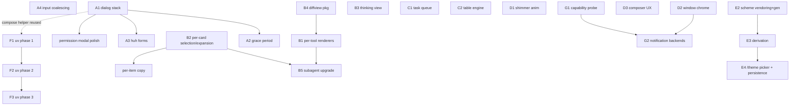

# TUI premium-feel program — design

Status: draft (awaiting maintainer sign-off); §B (transcript depth) OBSOLETE
as of 2026-07-20 — claude-pane-first deleted the custom transcript renderer,
so skip §B; the remaining workstreams target surfaces that still exist
(dashboard modals, session list, feed, theming). Backlog now lives in
TODO §2e ("dashboard premium-feel backlog").
Date: 2026-07-07
Provenance: five-agent comparative study of Charm Crush, ultraviolet, gh-dash,
huh, and the iTerm2-Color-Schemes collection vs. our TUI
(`internal/tui/dashboard`, `tui/*`). Extended the (now-closed) §2 "feels like
Claude Code" program in `TODO.md` — same goal (premium feel), new source
material.

## 0. License ground rules

These constrain *how* every item below may be implemented. They matter double
given OSS plans for this repo.

| Source | License | What we may do |
|---|---|---|
| charmbracelet/crush | **FSL-1.1-MIT** | Read, learn, **re-implement ideas in our own words only. Never copy code.** Each release converts to MIT two years out; "competing use" excluded (an agent TUI arguably competes). |
| charmbracelet/ultraviolet | MIT | Depend on / borrow freely (already an indirect dep via bubbletea v2). |
| charmbracelet/huh | MIT | Depend on freely. On our stack (bubbletea v2.0.8). |
| dlvhdr/gh-dash | MIT | Borrow code with attribution. Same exact Charm v2 stack as ours — near-zero port cost. |
| mbadolato/iTerm2-Color-Schemes | MIT | Vendor scheme data with attribution (NOTICE entry). |
| aymanbagabas/go-udiff, alecthomas/chroma/v2 | BSD/MIT | Depend on freely. |

Crush's `diffview` package carries **no separate license** — it is FSL. We
rebuild the same architecture ourselves on go-udiff + chroma (§B4).

**Every design below that traces to Crush is a description of behavior to
re-implement originally, not a port.**

## 1. Goal and principles

Make the TUI feel premium — responsive input, coherent dialogs, a transcript
with real depth (per-tool rendering, expandable reasoning, proper diffs),
polished motion, and user-selectable themes — while preserving the places we
are already *ahead* of the reference apps.

Principles:

- **Don't churn what already wins.** Keep and build on: the animated toast
  system (`notify.go`), the easing/`LerpColor` toolkit (`tui/anim`), the Kitty
  statusline gauge, the turn footer (richer than Crush's), queued-prompt /
  working / replay indicators, the virtualized list (`tui/list` — its
  `Render/Version/Finished` protocol is identical to Crush's; convergent
  design, already right), and our shadow + backdrop overlay chrome (Crush has
  neither).
- **Crush validates the architecture; it doesn't replace it.** Crush is
  single-session — our whole multi-session layer (SSE generations, warm
  models, attention routing) has no counterpart there. The §2a row-model
  consolidation stays our own problem and is unchanged by this plan.
- **Polish is mostly typography, spacing, and state-machine correctness** —
  Crush's dialogs have no animation, no shadows, no dimming, and still feel
  premium. Motion is the seasoning (§D), not the meal.

## 2. Workstreams

Ordered by felt-quality per unit of work within each stream. Dependencies in
§4.

---

### A. Interaction foundation (dialog stack, input path)

#### A1. Dialog stack manager

**Problem.** ~8 bespoke overlays (switcher `switcher.go`, permQueue
`permqueue.go`, help + confirm in `model.go`, rename `groups.go:230`,
backend/account picker `backend_picker.go` / `account_picker.go`, transcript
search `search.go`) each hand-roll open/close state, key routing
(`model_input.go:15-101` guard ladder), and overlay placement. The
center+shadow math is copy-pasted 4× (`model_render.go:122-166`,
`app.go:1009`, `app.go:1137`, `backend_picker.go:211`), and two overlay
mechanisms coexist (`lipgloss.Place` vs `Canvas`/`Compositor`) in the same
render function.

**Design** (Crush-inspired, original implementation; string/Canvas world — no
ultraviolet dependency, though A1 composes cleanly with F1 later):

- A minimal interface:
  - `ID() string` — stable identity (dedup, close-by-id, bring-to-front).
  - `HandleKey(tea.KeyPressMsg) (tea.Cmd, DialogResult)` — dialogs return
    typed *intent*, never mutate app state.
  - `Render(inner Size) string` — box body only; no positioning.
  - Optional: `Preferred(avail Size) Size`, `Cursor() *tea.Cursor`.
- One stack (`[]Dialog`, front = last) owned by **`App`** (the true root that
  already delegates exactly once, `app.go:717-734`). The dashboard `Model`
  opens dialogs by returning a result/command instead of owning parallel
  bools. Front dialog gets keys; all dialogs draw in stack order; non-key
  messages keep flowing to the dashboard (preserves the B17 fix).
- One `Compose(bg, dialog)` helper does centering + shadow
  (`solidBlock(theme.Shadow)` at +2/+1) + backdrop
  (`opaqueBackdrop`/`dimBackdrop`, `app.go:1160-1195`) + card — written once,
  deleting the 4 copies. **Keep our shadow/backdrop treatment** — it reads
  more premium than Crush's bare boxes.
- Typed-result demux in one place on `App` (mirrors Crush's central
  `handleDialogMsg`): results like close / attach / approve / open-other-dialog
  / raw `tea.Cmd`.

**Migration order** (each dialog is an independent, verifiable step): confirm →
help → rename → search → switcher → permQueue → backend/account picker.

#### A2. Grace period for async dialogs

**Problem.** Any dialog that pops *without* a user keystroke (permission
prompts when a session hits waiting state) can eat buffered keystrokes the
user was typing into the filter/rename/compose buffer — a blind-approve bug
class. Multi-session makes it worse: several sessions can go waiting
near-simultaneously.

**Design** (mechanics from Crush, re-implemented): when a dialog opens
*async*, swallow key presses until input has been quiet for **200ms**, hard
ceiling **1.5s** (each swallowed key resets the quiet timer; non-key messages
pass). Exception: if the **same dialog ID** re-opens within **500ms** of
closing (rapid back-to-back permission prompts), skip the grace — the user is
already focused there, and eating a key per prompt is hostile. User-initiated
opens never arm the grace.

#### A3. huh for form-shaped dialogs

huh (MIT, bubbletea v2.0.8) embeds as a string sub-model — it never owns the
program, signals via `StateCompleted`/`StateAborted`, sizes via
`WithWidth/WithHeight`. Adopt it **only** for form-shaped dialogs: rename,
confirm, add-account, and the multi-stage backend/account picker (its
`pickerStage` machine maps to a multi-group form). One `huh.ThemeFunc` binds
its styles to our `tui/theme` tokens; remap its abort key to our close key.

**Explicit non-goals:** switcher, permQueue, and any grouped/fuzzy session
list stay bespoke — huh's focused-field chrome is too opinionated for dense
list surfaces, and it can't do section-headed fuzzy filtering.

#### A4. Input coalescing (`tea.WithFilter`)

We have none. Add a program-level filter that rate-limits mouse wheel and
motion events to one sample per **16ms** (~60Hz), each stream with its own
clock. Wheel deltas **accumulate** across dropped samples (nothing lost; the
next allowed sample carries the sum) and **reset on sign flip** so a direction
change doesn't fight stale momentum. Keys, paste, and focus events pass
through untouched — a scroll flood can never queue ahead of a keypress.

---

### B. Transcript depth (where premium is won)

Builds on the existing pipeline: `blockCard` items (`transcript_list.go:46`),
the ⏺/⎿ card grammar (`transcript_render.go:427`), incremental streaming
markdown (`chat/streaming_markdown.go` — already equivalent to Crush's; no
change), `tui/list` virtualization (no change).

#### B1. Per-tool body renderers

Keep the shared ⏺-head/⎿-elbow frame; specialize the **body** via a dispatch
keyed on tool name (grow `toolExpandBody`, `transcript_render.go:524` into
it):

- **Bash** — output with raw ANSI remapped through the theme table (we have
  `kit.SetANSITable`; apply it here).
- **Read/View** — line-numbered, syntax-highlighted code (chroma), honoring
  offset; gutter width from digit count.
- **Edit/Write/MultiEdit** — the B4 diff package, full width (uncapped).
- **Grep/Glob/LS** — result lists.
- **Todos** — sorted checklist with per-status glyphs (✓ / → / •), header
  shows `completed/total · current task`.
- **MCP tools** — `server → tool` header; body auto-detects content: try
  JSON (pretty + highlight), else unified-diff, else markdown, else plain.
- **Fallback** — current generic rendering.

Shared helpers (one place each): header param budgeting (main param keeps
≥30 cols before k=v pairs append), collapsed 10-line body clamp with a
"… (N lines hidden — ctrl+o to expand)" footer, error tag treatment.

#### B2. Per-card expansion + selection

Today `ctrl+o` toggles only the **most recent** card
(`transcript_input.go:236-241`) and subagent collapse is global-only
(`subagent.go:124-144`). Add a selected-card index to the transcript (vim
j/k in NORMAL mode navigates cards); route expand (ctrl+o/space) to the
selected card's existing `expanded` bit (`transcript.go:72-74`). Unlocks:

- per-subagent collapse (the §4.4 gap),
- **per-item copy** (`y` on a selected tool card copies a structured markdown
  doc: tool call, params, result — nothing like this exists today),
- a visible selected-card highlight hung off the existing gutter model
  (`gutterPrefix`, `transcript_render.go:215`).

#### B3. Three-state thinking view

Today: live italic "∴ Thinking" tail (`transcript_render.go:354-363`) and a
one-line collapsed summary (`transcript_render.go:330-343`) — no middle
state. Design: reasoning cards get a
`collapsed → tail-window → full` cycle (expand key advances; collapse wraps):

- collapsed: last **10** rendered lines + "(N lines hidden)" hint;
- tail-window: last **200** lines (skipped entirely if it wouldn't truncate —
  cheap newline-count heuristic, no re-render);
- full: everything.
- **Slice lines *after* the glamour render** so fences/tables never tear.
- Keep separate stream caches for content vs reasoning (we already have the
  incremental renderer; add the second instance) so a content delta never
  invalidates the reasoning render.
- Visual: keep the ∴ glyph; consider Crush's quiet treatment — dim text on a
  barely-visible background fill (`SuccessSubtle`-style token) instead of
  italics for the non-live states; footer "Thought for <duration>".

This substantially completes the open transcript-UX workstream
(tool-card expansion + reasoning view).

#### B4. A real diff package (`tui/diffview` or `internal/.../diffview`)

Replace the hand-rolled LCS (`permission_diff.go:228-277`) and flat
`styleDiffLine` with a small original package on **go-udiff + chroma**:

- Fluent builder: before/after content, filename, context lines,
  unified/split, line numbers, x/y offsets, width/height, tab width.
- Hunked output with `@@` dividers; line-number gutters sized from digit
  count; `+`/`-` symbol column; full-line background tints
  (green/red *Subtle-style* fills from theme tokens: Guac/Coral derivatives).
- **Split view when width > 120**, unified otherwise.
- Per-line syntax-highlight cache keyed by hash(content + bg) so scrolling a
  big diff is cheap; lexer matched by path, cached.
- Upgrades **both** call sites that already share `styleDiffLine`: the
  permission box (`permission_diff.go:19-72`) and expanded Edit tool bodies.
- Word-level intraline diff: **out of scope** (Crush doesn't have it either);
  note as future work.
- Public `tui/` placement preferred (reusable, no app coupling) — consistent
  with the tui/kit precedent.

#### B5. Nested subagent card upgrade

Ours (`subagent.go`) already has the right invalidation discipline (child
mutation bumps the parent — same rule Crush arrived at). Upgrade the
presentation:

- Replace the hand-built fixed-indent `├/└` tree (`subagent.go:190-216`) with
  `lipgloss/tree` + a rounded enumerator (╰──) aligned to the card tag.
- Render children through the **same B1 dispatch** in a compact one-line mode
  (header only), replacing the bespoke `name arg · summary` line — also
  retires the §1c child-line width-budget residual by construction.
- Render the Task's returned summary text as the card body on completion (we
  drop it today).

---

### C. Dashboard actions & session list

#### C1. Async action task queue (gh-dash lift, MIT)

Our toasts route *attention*; nothing confirms *actions*. Borrow gh-dash's
model: `Task{ID, StartText, FinishedText, State(Start/Finished/Error), Err}`
in a map on the model; destructive/slow actions (destroy, suspend, resume,
cancel, sync ops) register a task and show in the statusline right segment:
spinner + "Destroying session…" → "✓ Session destroyed" / "✗ failed: …", a
`[⟳ N]` badge when several run concurrently, auto-clear 2s after finish.
Complements (does not replace) toasts.

#### C2. Table/column engine for the session list (gh-dash lift, MIT)

`Column{Title, Width *int, Grow *bool, Hidden *bool, Align}`: fixed-width
columns first, leftover divided among Grow columns; careful per-line ANSI
truncation with background extension. Adopt the runtime model for the session
list; **skip gh-dash's YAML column config** (over-engineered for our curated
columns — revisit only on user demand).

---

### D. Motion & chrome

#### D1. "Thinking" shimmer animation

The single most visible premium gap. Design (original, on top of `tui/anim`):

- A working indicator whose label sits after a short field of cycling glyphs
  with a **horizontal gradient** blended in a perceptual space (we have CIELAB
  `LerpColor`; Crush uses Hcl — either is fine, stay in-gamut).
- **Staggered fade-in**: each column has a birth step (~1s total), seeded
  deterministically per card ID so different cards shimmer differently but
  identically-keyed renders are byte-equal (cache-friendly).
- Frames **precomputed once per (settings-hash)** and shared across
  instances; per-tick render is pure string lookup. Tick messages carry an ID
  so only the owning card re-renders (our versioned-list model already bounds
  this to running cards).
- A no-scramble mode (label + animated ellipsis) for non-LLM waits.
- Honor `SANDBOX_REDUCE_MOTION` (falls back to the current static spinner).

#### D2. Window/terminal chrome

- `v.WindowTitle` = `sandbox <session-title>` (attention-flag prefix when a
  background session needs input — plays into the multi-session story).
- `v.ReportFocus` + focus tracking → suppress OS notifications while focused
  (feeds G2; today `model.go:774` notifies unconditionally).
- Native `tea.NewProgressBar` alongside the existing OSC 9;4 path
  (`app.go:736-751`): indeterminate while busy, with the ghostty keep-alive
  quirk (re-send with a changing percent so ghostty doesn't auto-hide it).
  Keep OSC 9;4 for terminals bubbletea doesn't cover.

#### D3. Composer micro-UX

- **Prompt history**: ↑/↓ at the compose line walks prior prompts
  (per-session; persist in the local index dir alongside
  `session.json`), preserving the in-progress draft at the bottom; esc
  restores the draft. This is the third leg of the open transcript-UX
  workstream.
- **Paste hygiene**: normalize CRLF; a paste over ~10 lines or ~1000 cols
  becomes an attachment chip (`paste_1.txt`) instead of flooding the compose
  box (size-capped).
- **Randomized state-aware placeholders**: small rotating sets for
  ready/working/shell states — cheap delight, zero risk.
- **Bang mode** (`!` prefix runs a shell command with streamed output): we
  already have `/` shell via `runShell` (`commands.go:384`) — consider
  promoting to the `!` idiom for CC familiarity; low priority.

---

### E. Theming (new workstream)

#### E1. Current state (good bones)

`tui/theme` already has: a semantic-token registry (3 hand-tuned themes:
Midnight/Daylight/Ember), in-place token swap + `Epoch()` cache invalidation +
`OnChange` re-skin, dark/light auto-pick from terminal background
(`ApplyForBackground`), a `SANDBOX_THEME` env override, a `Cycle()` stub that
already anticipates a `/theme` command, and a 16-entry ANSI remap
(`ansiTableFor`) so raw tool output follows the theme. Nothing structural
changes; theming work is **additive**.

#### E2. Imported themes from the iTerm2-Color-Schemes collection

The mbadolato/iTerm2-Color-Schemes repo (MIT) ships ~400 schemes
pre-exported to ~30 formats. **Use the `ghostty/` export format** (flat
`key = value` lines: `palette = N=#rrggbb` ×16, `background`, `foreground`,
`cursor-color`, `selection-background`, `selection-foreground`) — trivial to
parse, no plist/XML dependency.

Pipeline (mirrors the repo's schema→gen convention):

1. Vendor a **curated starter set** (~12–15, not all 400 — picker noise is
   real): Dracula, Catppuccin Mocha + Latte, Gruvbox Dark + Light, Nord,
   Tokyo Night, Solarized Dark + Light, Rosé Pine, Kanagawa, One Dark,
   Ayu Mirage. Files under `tui/theme/schemes/`, MIT attribution in a NOTICE
   entry.
2. A `just gen-themes` generator parses them into
   `tui/theme/schemes.gen.go` (never hand-edited; CI drift gate like the
   event model's).
3. Later (optional): load user files from `~/.config/sandbox/themes/*.conf`
   (same format) at startup — zero-code custom themes; any of the other ~385
   schemes becomes a drop-in file.

#### E3. Derivation: 22 scheme colors → our ~30 semantic tokens

A terminal scheme gives 16 ANSI + bg/fg/cursor/selection. Our tokens are
semantic (surface stack, 5-step text ramp, paired accent+Subtle roles). One
`Derive(scheme) Theme` function, all blending perceptual (reuse/relocate the
CIELAB lerp from `tui/anim`):

| Token(s) | Derivation |
|---|---|
| `Page` | scheme background |
| `Surface / Raised / Raised2` | mix(bg → fg) ≈ 5% / 9% / 13% |
| `BorderSubtle / BorderMedium` | Raised2 / mix ≈ 20% |
| `TextBright` | fg (or ANSI 15 if higher contrast vs Page) |
| `TextBody / TextSecondary / TextMuted / TextDim` | mix(fg → bg) ≈ 18% / 35% / 48% / 65% |
| `Coral` (error) / `Guac`+`Success` / `Gold`+`Warning` / `Info` / `Malibu` / `Dolly` | ANSI red / green / yellow / blue / cyan / magenta — per slot, pick the more saturated of normal vs bright |
| `Charple` (brand) | cursor color if saturated enough (it's usually the scheme's signature accent), else magenta/blue pick |
| `Hazy` | mix(Charple → bg) ≈ 35%; `Dolly` stays magenta |
| `Peach` / `Denied` | blend(red, yellow) — orange approximations |
| `Busy` | blend(yellow, green) toward the scheme's chartreuse |
| `*Subtle` fills | mix(accent → bg) ≈ 82–85% |
| `Shadow` | darken bg (dark themes) / desaturated darken (light) |
| dark/light | relative luminance of bg |

**ANSI fidelity:** derived themes pass the scheme's **own 16 ANSI colors** to
`kit.SetANSITable` instead of the semantic remap — imported themes keep
authentic tool/shell output (Dracula's red is Dracula's red). Curated themes
keep the semantic remap.

**Contrast guardrails:** after derivation, enforce minimum contrast vs `Page`
(TextBody ≥ ~4.5:1, TextMuted ≥ ~3:1, accents ≥ ~3:1), clamping lightness
when a scheme fails. A unit test iterates every vendored scheme and asserts
the floors — bad schemes fail CI, not the user's eyes.

#### E4. Theme UX

- **`/theme` picker** via the command palette (joins the picker-ification of
  `/model` + `/effort` from the CC-parity plan): grouped list — "Sandbox"
  (curated) / "Imported" / "Auto (match terminal)". **Live preview**:
  highlight applies the theme immediately (cheap — `ApplyTheme` + `Epoch`
  already make this a full clean re-skin), esc reverts to the previous theme,
  enter commits.
- **Persistence**: chosen theme saved to a small local config (proposal:
  `~/.config/sandbox/config.json`, a new tiny `internal/config`; the index
  dir stays per-session state). Precedence: `SANDBOX_THEME` env >
  saved choice > auto dark/light. "Auto" stays the default.
- Auto mode keeps the existing dark/light pairing; a saved *specific* theme
  pins regardless of terminal background (each theme knows its own
  darkness).

#### E5. Degradation & special modes

- **Color-profile degradation**: we gate gradients on TrueColor today;
  imported themes must also survive 256-color terminals (lipgloss/colorprofile
  downsampling handles conversion; the contrast test should run post-derivation
  values, which is profile-independent).
- **Transparency mode** (future, pairs with F1): a config flag that skips
  setting `v.BackgroundColor` and skips opaque fills so the terminal's own
  background shows through — cheap to honor once opacity is cell-based.
- **High-contrast theme**: one hand-tuned accessibility theme in the curated
  set (widened text ramp, no low-contrast Subtle fills).

---

### F. Rendering substrate (ultraviolet) — structural, gated on ADR

Key fact: **bubbletea v2 already renders through ultraviolet** — our View
string is decoded via `uv.StyledString` and diffed by the uv renderer today.
Adopting uv means composing cells ourselves before handing bubbletea the
string. Per-leaf and reversible; no flag day. uv is v0/no-semver (risk
mitigated by the herd effect: it underpins bubbletea, lipgloss, and Crush).

- **Phase 1** — root compositing + opacity: `App.View` draws into a
  `uv.NewScreenBuffer(w,h)`; clear + fill with a `theme.Page` background
  cell; every existing string view wraps in `uv.NewStyledString(...).Draw`.
  **Deletes** `withBackground`/`bgSeq` SGR re-splicing and `clampLines`
  padding (`zones.go:50-105`) outright — per-cell `Style.Bg` makes opacity
  free.
- **Phase 2** — overlays: `modalView`'s `Canvas`/`Compositor`/`Layer` stack
  and the `lipgloss.Place` path both become ordered draws (backdrop fill →
  shadow fill → card) into the one buffer; cursor becomes a returned
  `*tea.Cursor` (topmost overlay wins). Collapses the dual overlay systems;
  composes with A1's single `Compose` helper.
- **Phase 3** (perf, only if needed): a decode-cache around the transcript's
  `list.Render()` string (memoize decoded cells keyed on the rendered string)
  so byte-identical frames skip ANSI re-parse; mouse hit-testing moves from
  string zones to rect containment against retained layout rects.
- **What uv does NOT fix** (and therefore no full rewrite): `tea.Raw` for
  Kitty APC/OSC is inherent to the View-string boundary — our current
  split (placeholders in content, transmission out-of-band) is exactly what
  Crush and native uv do; mid-run child `WindowSizeMsg` seeding
  (`app.go:600-606`) is a bubbletea lifecycle issue.
- Deliverable before code: a short ADR (this section is its seed) with the
  Phase-1 diff scoped.

### G. Terminal integration (lower priority)

- **G1. Capability probing**: one startup `tea.Raw` probe burst — DA1,
  XTVERSION, pixel size (for exact gauge cell metrics, replacing the
  hardcoded values in `statusline.go:195`), Kitty graphics query, OSC 99
  support query — **gated on a terminal allowlist** (ghostty/kitty/wezterm/
  alacritty/rio; suppressed for Apple Terminal / plain SSH) so dumb terminals
  never see garbage. Responses fill the existing `tui/terminal` caps struct;
  env detection stays as the fallback. tmux: wrap Kitty probe in passthrough.
- **G2. Notification backend selection**: today OSC 777/9 unconditionally
  (`tui/terminal/osc.go:84`). Add a small backend set — native OS (beeep),
  OSC 99 (probed), OSC 777, bell, none — selected from caps + config, and
  suppress while the window has focus (needs D2's focus tracking). Keep the
  in-TUI toast as the primary surface; OS notification is the escalation.

## 3. Explicit non-goals

- Porting Crush code (license) or adopting its single-session UI shape.
- huh as a universal dialog engine (dense lists stay bespoke).
- gh-dash's YAML-configurable columns (curated columns only, for now).
- Driving `uv.Terminal` directly / leaving bubbletea (kills the Update/Cmd
  model for marginal gain).
- Word-level intraline diff highlighting (neither we nor Crush have it).
- Shipping all 400 iTerm schemes (curated set + user drop-in files instead).

## 4. Sequencing & dependencies

Suggested batches (each independently shippable, `just check` green):

1. **Quick wins**: A4, D2 (title/focus/progress), C1 task queue, D1 shimmer.
2. **Dialog consolidation**: A1 → A2 → A3 (+ permission modal polish).
3. **Transcript depth**: B4 diffview → B1 per-tool bodies → B2 selection →
   B3 thinking → B5 subagents (order within batch matters; B2/B3 parallel).
4. **Theming**: E2 → E3 → E4 (independent of everything else; can run any
   time).
5. **Substrate**: F1/F2 behind an ADR sign-off; G1/G2 opportunistic.

## 5. Verification

- Per the repo protocol: `just check` gates every batch; new packages
  (diffview, theme derivation) get table-driven unit tests.
- **Theme contrast test** (E3): iterate all vendored schemes × derived tokens,
  assert contrast floors — a failing scheme is a CI failure.
- **Golden-frame tests** for the new renderers (diffview, per-tool bodies,
  thinking states) — deterministic width/theme inputs, goldens under
  `testdata/` (charm's `x/exp/golden` is MIT if we want the helper).
- Grace-period and dialog-stack state machines: pure unit tests over
  synthetic key sequences (no PTY needed).
- In-sandbox caveats unchanged (`docs/verification-protocol.md`).

## 6. Backlog linkage

Tracked as TODO.md **§2e** (this doc is the detail; items there carry the
`file:line` anchors). The §2a structural enablers remain prerequisites for the
heaviest §2c renderer work and are *not* superseded by this plan.
