# Per-session git worktree lifecycle — design

**Status:** ACCEPTED (maintainer sign-off 2026-07-07) — the §9 open questions
are resolved (see archive/decision-proposals-2026-07-06.md §4): (1) add
`Spec.WorkspacePath`, `ProjectPath` stays the repo root; (2) transcripts key
off the worktree path — accepted; (3) `WorktreeAuto` default from day one;
(4) non-git collision warns only; (5) dirty destroy = silent WIP commit to
the session branch, `--discard` opt-out; (6) no merge helper in v1; (7)
cross-machine attach ships B1 only (maintainer rarely roams machines); (8)
**the TUI owns the branch-name/commit-message proposal prompt** — no
`Session.ProposeBranch` SDK helper in v1 (avoids the propose-exchange landing
in the session transcript; the SDK surface stays the deterministic
`ConvertToBranch` only — revisit the helper if an external consumer asks);
(9) any valid ref, prompt suggests prefixes; (10) worktree root
`~/.local/share/sandbox/worktrees/<id>` + move `ssh/` inside the state root
in the same pre-OSS break. Implementation is unblocked: Spec split →
auto-worktree at Create → capture-then-remove teardown/reap →
convert-to-branch → TUI proposal prompt.
**Owner ask:** TODO.md §9 "Per-session git worktree lifecycle" (promoted from inbox 2026-07-04).
**Cross-ref:** TODO.md §1d "Concurrent sessions on one project share one local sync endpoint, no dedup" (`internal/sync/sync.go:197` — the collision is analyzed in §3 below and, spoiler, per-session worktrees fix it for git projects).
**SDK-first:** every new capability is specified as a `client/` addition first; the CLI/TUI dogfood it (CLAUDE.md "New capability goes HERE first, not in `internal/cli`").

This document specifies behavior and the exact SDK surface. It deliberately does **not** implement anything.

---

## 1. Goals & invariants

The maintainer's spec, restated as testable invariants:

- **I1 — isolation:** each session works in its own directory so two agents on one repo never cross-feed edits (fixes §1d).
- **I2 — never lost:** work is never reachable *only* under a cryptic worktree name, and never silently deleted. Every teardown path (destroy, reap, convert) either lands the work on a named, laptop-reachable git ref or refuses.
- **I3 — deterministic git, LLM content only:** the "convert to branch" affordance uses the LLM to *propose* a branch name and commit message (content), but all git operations run CLI-side, deterministically, behind a human confirmation. The LLM never runs `git`.
- **I4 — laptop-authoritative merge:** mutagen carries files laptop→pod and pod→laptop, but *merging into `main` happens laptop-side*. The remote (pod) never pulls or merges; the pod is a plain checkout with no `.git`.
- **I5 — graceful non-git fallback:** a non-git project (or missing `git`) still works, just without the worktree isolation — it falls back to today's behavior.

Non-goals: pushing branches to a remote forge, opening PRs, resolving merge conflicts for the user, or syncing git *history* (commits) to the pod.

---

## 2. Current behavior (grounded)

Read before trusting any claim below: `client/client.go`, `client/session.go`, `client/sync.go`, `internal/sync/sync.go`, `internal/k8s/backend.go`.

### 2.1 Create does not touch the working tree

`Client.Create` (`client/client.go:292`) mints an id, prepares the SSH key, calls `backend.CreateSession`, and records a local index entry. `opt.ProjectPath` is **required** (`client/client.go:297`) and flows unchanged into `session.Spec.ProjectPath` (`client/client.go:336`). Create does not create directories, checkouts, or worktrees. `NewID` (`client/client.go:446`) hashes `projectPath` into the id so sessions on one repo *group* by a 6-char path hash.

### 2.2 The pod bind-mounts the workspace at the real host path

`runnerVolumeMounts` (`internal/k8s/backend.go:1292`) mounts the PVC at `/session`, and — when `ProjectPath` is absolute — *also* bind-mounts `workspace<ProjectPath>` (a subPath) at `MountPath: spec.ProjectPath`, i.e. the literal host path like `/Users/cullen/git/homelab`. The doc comment (`backend.go:1286`) is explicit about *why*: the Claude SDK keys its transcript directory off cwd (`~/.claude/projects/<cwd with '/'→'-'>`), so making the pod cwd equal the host path is what makes a k8s session's transcript land in the folder `claude --resume` reads locally. `PROJECT_PATH` env is set to the same value (`backend.go:1329`).

### 2.3 Mutagen project sync: both endpoints are the same absolute path

`startMutagen` (`client/sync.go:148`) builds a `sync.Spec` with **`RemotePath: projectPath`** — identical to the local `ProjectPath` (`client/sync.go:170-171`), with the comment "both sync endpoints use the same absolute path." `createProjectSync` (`internal/sync/sync.go:172`) then creates a `two-way-safe`, `--ignore-vcs` mutagen session named `sandbox-<SessionID>-project`, with the local alpha = `spec.ProjectPath` and remote beta = `spec.SSHHost + ":" + spec.RemotePath` (`internal/sync/sync.go:197`).

Two facts that matter for the design:

- **`--ignore-vcs`** (`internal/sync/sync.go:192`) means `.git` is never synced. The pod is therefore *not a git repo* today — `emitWorkspaceStatus` (`runner/src/claude.ts:829`) runs `git` in the pod cwd and silently emits nothing when it isn't a repo (`claude.ts:842`). So the "git story is laptop-side only" is already the de-facto state; this design makes it intentional.
- **two-way-safe** (`internal/sync/sync.go:191`, long comment at 185-191): on a both-sides edit of one path mutagen *halts* that path and surfaces a conflict rather than clobbering. It does not pick a winner.

### 2.4 Connect wiring

`Session.Connect` (`client/session.go:135`) resolves `projectPath` from `opt.ProjectPath` or cluster status (`session.go:152-156`), forwards ports, and — for a full (non-Observer) connect — calls `startMutagen(... s.projectPath ...)` (`client/session.go:259`). So the *local* mutagen endpoint is always `s.projectPath`, discovered from cluster `State.ProjectPath` on a bare `attach` (`internal/k8s/backend.go:789`, `sandboxEnv(sb,"PROJECT_PATH")`).

---

## 3. Does a per-session worktree fix the §1d collision? — CONFIRMED (git projects)

**The §1d TODO note's stated mechanism is slightly imprecise.** It says "Mutagen session name keys on SessionID only." The session *name* (`sandbox-<SessionID>-project`) is in fact already unique per session. The real collision is the **local alpha path**: for every session on repo `/repo`, `createProjectSync` sets alpha = `spec.ProjectPath = /repo` (`internal/sync/sync.go:197`). So:

```
session A:  alpha = /repo   beta = sandbox-A:/repo
session B:  alpha = /repo   beta = sandbox-B:/repo
```

Both mutagen sessions watch the **same** local directory `/repo`. Pod A writes `foo.go` → mutagen A propagates it down into `/repo` → mutagen B observes `/repo` changed → propagates it up into pod B. Two agents cross-feed, and a same-file edit on both sides becomes a perpetual two-way-safe conflict (§2.3). This is a shared-*path* problem, not a shared-*name* problem — renaming the mutagen session would not help.

**Per-session worktrees fix it** by giving each session a distinct local alpha path (§4.1): alpha becomes `<worktreeRoot>/<id>`, unique per session. Mutagen A and B now watch disjoint directories; nothing cross-feeds. For this to hold, the pod's bind-mount `MountPath` (beta path) must also become the worktree path so the two endpoints still match (required anyway for transcript resumability, §2.2). So the fix is real **but conditional**: it only applies when a worktree exists, i.e. git projects. **Non-git projects retain the §1d collision** under the fallback (§4.5) — this should stay documented as a known limitation, or non-git projects on the same repo should warn.

---

## 4. Design

### 4.1 Local directory layout

Worktrees live **outside** the repo, in a sandbox-owned root, keyed by session id:

```
~/.local/share/sandbox/
├── remote-sessions/          # existing state dir (index + per-session ssh keys)   client/client.go:116
├── ssh/config                # existing per-session ssh include                    client/sync.go:139
└── worktrees/                # NEW
    └── <session-id>/         # `git worktree add` target; mutagen alpha; pod cwd
```

Rationale:
- **Outside the repo** so the user's main checkout and `git status` in `/repo` are never polluted by a nested worktree, and so a repo-internal `.gitignore` isn't required.
- **Sandbox-owned root** (sibling of the existing `remote-sessions`/`ssh` dirs) so cleanup/reaping has one place to enumerate, and so it inherits the same `WithStateDir` relocation story (§8).
- **Keyed by session id**, not by branch name, because the id exists before any branch is named and is globally unique.

The worktree is created on an auto-branch **`sandbox/<session-id>`** from the repo's current `HEAD`:

```
git -C /repo worktree add -b sandbox/<id> ~/.local/share/sandbox/worktrees/<id> HEAD
```

Using `-b sandbox/<id>` (not detached HEAD) is what satisfies **I2 from the very first commit**: any commit the user/agent makes is reachable as a real branch `sandbox/<id>`, never floating. "Convert to branch" (§4.6) is then just a *rename* of an already-safe branch into a nicer name — not a rescue from a detached state.

### 4.2 Data-model change: split "repo root" from "workspace path"

Today `session.Spec.ProjectPath` is overloaded: it is (a) the id-grouping hash input, (b) the pod bind-mount path, (c) the mutagen endpoint, and (d) the display/index path. A worktree needs (b) and (c) to point at the worktree while (a) and (d) keep pointing at the repo root (so sessions still group by repo and the UI still shows the repo).

Proposed split (exact naming is an open question, §9):

- `Spec.ProjectPath` — unchanged meaning: the **repo root** the user launched from (grouping, display, index).
- `Spec.WorkspacePath` — NEW: the path bind-mounted into the pod and used as both mutagen endpoints. Defaults to `ProjectPath` when there is no worktree (backward-compatible).

`runnerVolumeMounts` (`backend.go:1292`), `PROJECT_PATH` env (`backend.go:1329`), and `startMutagen`'s `ProjectPath`/`RemotePath` (`client/sync.go:170`) switch from `ProjectPath` to `WorkspacePath`. The transcript-resumability contract (§2.2) is preserved because pod cwd still equals the local alpha path — it's just the worktree path on both sides now.

> Transcript note: transcripts will now key off the worktree path (`~/.local/share/sandbox/worktrees/<id>`), so `claude --resume` groups them under that folder rather than under `/repo`. This is arguably *better* (per-session transcript isolation) but is a behavior change worth the maintainer's eye — see §9.

### 4.3 (a) Auto-create the worktree at session create

New `CreateOptions.Worktree` control (enum, not bool, to leave room — §9):

- `WorktreeAuto` (default): create a worktree iff `ProjectPath` is inside a git work tree and `git` is available; else fall back (§4.5).
- `WorktreeOff`: never; behave exactly as today.
- `WorktreeOn`: require a worktree; error if the project isn't a git repo.

Placement in `Client.Create` (`client/client.go:292`), after id minting and **before** `backend.CreateSession`:

1. Detect git: `git -C ProjectPath rev-parse --show-toplevel` (deterministic, no LLM).
2. If creating: `git -C <toplevel> worktree add -b sandbox/<id> <worktreeRoot>/<id> HEAD`.
3. Set `spec.WorkspacePath = <worktreeRoot>/<id>` (repo `ProjectPath` unchanged).
4. Record the worktree path + branch in the local index entry (`internal/index`) so reaping and cross-machine attach can reason about it.

The worktree is a laptop-side git op; it needs no pod and fits Create's "does not wait for the pod" contract (`client/client.go:290`).

**Interaction with two-way-safe mutagen (§2.3):** the freshly-added worktree contains the repo's `HEAD` tree; the pod's PVC workspace starts empty. On first sync, two-way-safe sees files present only on alpha (worktree) → propagates them up to the pod (pure additions, no conflict, nothing to clobber). Thereafter the pod's edits flow back down into the worktree. Because `--ignore-vcs` skips `.git` (§2.3), the worktree's `.git` *file* (a gitdir pointer) is never synced — correct, since it would point at a path that doesn't exist in the pod. The pod stays a plain, git-less checkout; all git lives on the laptop.

### 4.4 (b) placement recap

(b) "convert to branch" is detailed in §4.6; it depends on the worktree existing from §4.3.

### 4.5 Non-git projects (graceful fallback — I5)

When `ProjectPath` is not a git work tree (or `git` is missing) under `WorktreeAuto`:

- No worktree is created. `WorkspacePath = ProjectPath`. Everything behaves exactly as today (bind-mount at `ProjectPath`, mutagen alpha = `ProjectPath`).
- **The §1d collision persists for non-git projects.** Mitigation: emit a `Connection.Warning` (same channel as the sync/protocol warnings, `client/session.go:226,258`) when Create/Connect detects another live session already syncing the same `ProjectPath`. Detection can reuse `syncManager().List()` (`internal/sync/sync.go:288`) to see if a `sandbox-*-project` alpha already targets this path. (Open question §9: warn-only vs refuse.)
- `WorktreeOn` on a non-git project returns a new sentinel error (`ErrNotAGitRepo`).

### 4.6 (b) Convert-to-branch: LLM proposes, git executes, human confirms (I3)

Trigger: a TUI keymap (e.g. `b` on a session, alongside detach/interrupt). The flow, strictly separating *content generation* from *git execution*:

1. **Gather deterministic facts (CLI-side):** `git -C <worktree> status --porcelain`, `git -C <worktree> diff` (or `diff --stat`), current branch (`sandbox/<id>`).
2. **LLM proposes content only:** the diff/status is handed to the agent (a normal turn, or a dedicated prompt) which returns a proposed branch name (kebab, prefixed e.g. `feat/…`) and a commit message. The LLM returns *strings*; it does not run git. This is the only LLM involvement.
3. **Human confirms:** a TUI modal shows the proposed branch name + commit message, editable, with explicit accept/cancel. Nothing runs until the human accepts.
4. **Deterministic git execution (CLI-side, in `client/`):**
   ```
   git -C <worktree> add -A
   git -C <worktree> commit -m <approved message>          # only if there are changes
   git -C <worktree> branch -m sandbox/<id> <approved name> # rename the auto-branch
   ```
   `branch -m` renames the existing `sandbox/<id>` branch, so history is preserved and the work is now on a human-meaningful ref. If `<approved name>` already exists, fail loudly (no `-M` force) and let the human pick another.

The SDK method that performs step 4 takes the already-approved strings as parameters (§7) — the git path is pure and unit-testable with a temp repo; the LLM/human parts live in the TUI/caller.

### 4.7 (c) Merge & cleanup semantics; the never-lost invariant (I2/I4)

**Merge is laptop-side; the remote never pulls (I4).** Merging happens between two *laptop* git refs and does not touch the pod:

- The user's real checkout at `/repo` is on `main` (or wherever). The sandbox worktree is a separate working tree on branch `<approved name>` (post-convert) or `sandbox/<id>` (pre-convert).
- Merging is `git -C /repo merge <branch>` (or a PR later). This mutates `/repo` — **not** the worktree — so mutagen (whose alpha is the *worktree*, not `/repo`) never sees it and never propagates it to the pod. The pod cannot pull because it has no `.git`. I4 holds structurally, not by convention.
- The design does **not** auto-merge. It offers convert-to-branch; the human merges/PRs on their own schedule. (Open question §9: offer an optional `git -C /repo merge` helper.)

**Cleanup ordering to preserve I2.** A worktree may be removed only after its contents are captured on a ref:

- `git worktree remove` refuses a dirty worktree by default — good, that's a safety net. The SDK's teardown must, in order: (1) check `git status --porcelain` in the worktree; (2) if dirty, either commit to the current branch (`sandbox/<id>` or the converted name) or refuse and surface the dirt to the caller; (3) only then `git worktree remove`. Never `--force` past uncommitted work silently.
- Because the branch `sandbox/<id>` exists from creation (§4.1), even an un-converted session's committed work survives worktree removal — the branch remains in `/repo/.git`. Removing the worktree removes the working directory, not the branch.

### 4.8 (d) Reaping abandoned worktrees

Two kinds of orphan:

1. **Worktree with no live session** — session destroyed/gone but the worktree dir remains (crash mid-destroy, or `RemoveLocalState` didn't run the git step). 
2. **Stale git admin entries** — `/repo/.git/worktrees/<id>` left behind after a manual `rm -rf` of the worktree dir.

A `Client.ReapWorktrees(ctx, ReapOptions)` (§7) enumerates `<worktreeRoot>/*`, cross-references the local index and live-session list (mirrors the existing sync GC that uses `syncManager().List()` + `IsOrphanStatus`, `internal/sync/sync.go:288,329`), and for each orphan:

- **clean** worktree → `git worktree remove` + drop index entry.
- **dirty** worktree → **never delete outright (I2).** Auto-commit a WIP commit to `sandbox/<id>` (or the converted branch), *then* remove the worktree. The branch preserves the work; the reap message reports the branch name so the user can find it.
- run `git -C /repo worktree prune` to clear stale admin entries (case 2).

Surfaced via a CLI verb (e.g. `sandbox worktree gc`) and, optionally, opportunistically during other GC passes.

### 4.9 Suspend / resume / destroy interactions

- **Suspend** (`client/client.go:388`): pod terminates, mutagen paused (`PauseAll`). The worktree is a *laptop* artifact — it is untouched and persists. No git op. Correct: the user's in-progress work stays on disk and on branch `sandbox/<id>`.
- **Resume** (`client/client.go:399` / `Connect`): pod comes back, mutagen resumes (`ResumeAll`), re-syncs the worktree ↔ pod. The worktree is still there; if it were somehow missing (user deleted it), Connect must detect the missing alpha and either recreate it from `sandbox/<id>` (`git worktree add <path> sandbox/<id>`) or warn — see §4.10 / §9.
- **Destroy** (`client/client.go:409`): after the cluster destroy + `StopSync`, `RemoveLocalState` (`client/sync.go:60`) currently removes ssh alias + key dir + index entry. It gains a worktree step following the §4.7 ordering: capture-if-dirty, then `git worktree remove`, then `git worktree prune`. **Destroy must not silently discard uncommitted work (I2)** — a dirty worktree at destroy either commits to `sandbox/<id>` (default) or blocks with a warning the caller must acknowledge (open question §9: default commit vs require flag).

### 4.10 `sandbox attach` from a second machine

This is the hardest case and the design accepts a **documented limitation**.

The worktree and its branch `sandbox/<id>` live in *machine A's* `/repo/.git`. Machine B has neither the worktree directory nor the branch (branches aren't pushed anywhere — I4 keeps everything local). When machine B runs `sandbox attach <id>`, `Connect` discovers `WorkspacePath` from cluster status (`backend.go:789`) = `~/.local/share/sandbox/worktrees/<id>` — a path that does not exist on machine B.

Options, in preference order:

- **B1 (recommended default):** attach succeeds for the *runner* surface (turns, events, permissions — the TUI works), but **file sync falls back or is skipped** with a `Connection.Warning`: "file sync is bound to the machine that created this session; edits here won't be mirrored." Rationale: machine B cannot reconstruct the branch history (it was never pushed), so pretending to sync into a fresh empty dir risks either an empty-alpha two-way-safe delete-storm or a divergent tree with no git backing. Better to be honest and read-only-ish for files.
- **B2 (opt-in):** if machine B has the *same* repo at the *same* `ProjectPath` and the user passes an explicit flag, create a **local** worktree on B from B's own `HEAD` (a fresh `sandbox/<id>` on B) and sync into it. This diverges from A's branch and is only safe if A is not concurrently syncing — effectively "move the session to B." Gated behind an explicit flag; not the default.

The authoritative rule: **a session's worktree has a home machine.** Cross-machine attach is a runner/TUI convenience, not a file-sync guarantee. (§9 asks whether B2 is worth building now.)

---

## 5. Lifecycle diagram

```mermaid
stateDiagram-v2
    [*] --> Created: sandbox claude (git repo)

    state "Create (laptop-side git)" as Created {
        [*] --> DetectGit
        DetectGit --> AddWorktree: git repo + WorktreeAuto/On
        DetectGit --> Fallback: non-git (WorktreeAuto)
        AddWorktree --> [*]: worktree @ ~/.local/share/sandbox/worktrees/&lt;id&gt;\nbranch sandbox/&lt;id&gt; from HEAD\nWorkspacePath = worktree path
        Fallback --> [*]: WorkspacePath = ProjectPath (today's behavior, §1d persists)
    }

    Created --> Working: Connect (port-forward + mutagen alpha = worktree)

    state Working {
        [*] --> Editing
        Editing --> Editing: agent edits → mutagen pod→worktree\n(distinct alpha per session ⇒ no §1d cross-feed)
        Editing --> Converted: convert-to-branch (keymap)
        note right of Converted
            LLM proposes name+message (content only)
            human confirms
            git add/commit/branch -m run CLI-side (deterministic)
            sandbox/&lt;id&gt; → feat/nice-name
        end note
    }

    Working --> Suspended: suspend (mutagen paused; worktree persists)
    Suspended --> Working: resume (mutagen resumed)

    Working --> Merging: user merges laptop-side
    Converted --> Merging
    Merging --> Working: git -C /repo merge &lt;branch&gt;\n(remote never pulls — I4)

    Working --> Teardown: destroy
    Converted --> Teardown
    Suspended --> Teardown

    state "Teardown (capture-then-remove — I2)" as Teardown {
        [*] --> CheckDirty
        CheckDirty --> Commit: dirty → WIP commit to branch
        CheckDirty --> Remove: clean
        Commit --> Remove
        Remove --> [*]: git worktree remove + prune
    }
    Teardown --> [*]

    Working --> Reap: abandoned (no live session)
    Reap --> Teardown: ReapWorktrees (never delete dirty outright)
```



---

## 6. What lands where (SDK-first)

| Layer | Responsibility |
|---|---|
| `client/` (SDK) | Worktree create/detect at `Create`; `WorkspacePath` plumbing; deterministic git ops for convert/teardown/reap; new options/methods/errors (§7). **All git execution lives here**, pure and testable. |
| `internal/index` | Persist worktree path + branch per session (for reap + cross-machine reasoning). |
| `internal/k8s/backend.go` | Bind-mount + `PROJECT_PATH` switch from `ProjectPath` → `WorkspacePath`. |
| `internal/sync` | Endpoints already derive from what `startMutagen` passes; only the caller (`client/sync.go`) changes to pass `WorkspacePath`. |
| `internal/cli` / `internal/tui/dashboard` | The convert-to-branch keymap + confirm modal; `sandbox worktree gc`. **Content generation (LLM) and human confirmation live here**, never in the git path. |
| `sdktest/` | Pin the new public surface (§7) as an external consumer, per the conformance rule. |

---

## 7. Exact SDK surface additions (specification only — do not implement)

New/extended types and methods on `client/`. Signatures are the contract; bodies are out of scope for this doc.

```go
// --- client/client.go ---

// WorktreeMode selects per-session worktree behavior at Create.
type WorktreeMode int
const (
    WorktreeAuto WorktreeMode = iota // worktree iff ProjectPath is a git work tree and git is present
    WorktreeOff                      // never (today's behavior)
    WorktreeOn                       // require; ErrNotAGitRepo if ProjectPath isn't a git repo
)

// CreateOptions gains:
type CreateOptions struct {
    // ...existing fields...
    Worktree WorktreeMode // default WorktreeAuto
}

// New sentinel errors (client/errors.go):
//   ErrNotAGitRepo            — WorktreeOn on a non-git ProjectPath
//   ErrWorktreeExists         — the target worktree path/branch already exists
//   ErrWorktreeDirty          — a teardown/convert would lose uncommitted work and no capture was authorized
//   ErrBranchNameTaken        — convert target branch name already exists

// --- client/session.go ---

// WorktreePath returns the session's local worktree dir, or "" if the session
// has no worktree (non-git fallback / WorktreeOff).
func (s *Session) WorktreePath() string

// WorktreeStatus returns deterministic git facts for the worktree (branch,
// dirty, ahead/behind, changed-file list). Errors if the session has no worktree.
func (s *Session) WorktreeStatus(ctx context.Context) (WorktreeStatus, error)

type WorktreeStatus struct {
    Path    string
    Branch  string   // "sandbox/<id>" until converted
    Dirty   bool
    Changed []string // porcelain paths, for the convert modal / diff
}

// ConvertToBranch runs the DETERMINISTIC git side of convert-to-branch:
// add -A, commit (if dirty) with Message, then branch -m onto BranchName.
// It takes ALREADY-APPROVED, LLM-generated + human-confirmed strings — it does
// NOT call any LLM and does NOT prompt. Fails with ErrBranchNameTaken rather
// than force-renaming. Pure/testable against a temp repo.
func (s *Session) ConvertToBranch(ctx context.Context, opt ConvertOptions) (BranchResult, error)

type ConvertOptions struct {
    BranchName string // human-approved, e.g. "feat/foo" — validated as a git ref
    Message    string // human-approved commit message; empty allowed only if worktree is clean
}
type BranchResult struct {
    Branch    string // final branch name
    Committed bool   // whether a commit was created
    CommitSHA string
}

// --- client/client.go (client-level lifecycle) ---

// ReapWorktrees GCs orphaned worktrees: capture-if-dirty then remove; prune
// stale admin entries. Never deletes dirty work outright (commits to the
// session branch first). Reports what it did.
func (c *Client) ReapWorktrees(ctx context.Context, opt ReapOptions) ([]ReapedWorktree, error)

type ReapOptions struct {
    DryRun bool // enumerate + classify without mutating
}
type ReapedWorktree struct {
    SessionID   string
    Path        string
    Branch      string
    Action      string // "removed" | "committed-then-removed" | "pruned" | "skipped"
    CommitSHA   string // set when dirty work was captured
}
```

Notes:
- `Destroy` (`client/client.go:409`) gains the teardown-with-capture step internally (no signature change), governed by a new field on a destroy-options struct if the maintainer wants an explicit "discard dirty" opt-in rather than the default WIP-commit (§9).
- The LLM proposal step is intentionally **absent** from the SDK git surface. If a proposal helper is wanted, it belongs as a separate method that runs a *turn* (e.g. `Session.ProposeBranch(ctx) (BranchName, Message string)`) and returns strings — kept distinct from `ConvertToBranch` so the git path never depends on an LLM (I3). Whether to ship that helper is §9.

---

## 8. `WithStateDir` / relocation

The worktree root is a new sibling under the sandbox app dir, so it must follow the same relocation rule as the ssh include (`client/client.go:116-124`): derive it from `dir(stateDir)` (default `~/.local/share/sandbox/worktrees`), so `WithStateDir` consumers keep everything inside their app dir. This dovetails with the existing open item "WithStateDir ssh-dir layout" (TODO §8) — worth resolving the two together so the app-dir layout is decided once.

---

## 9. Open questions for the maintainer

1. **Spec split naming.** Add `Spec.WorkspacePath` alongside `Spec.ProjectPath` (repo root)? Or invert — keep `ProjectPath` = the bind-mount/sync path (worktree) and add `Spec.RepoRoot` for grouping/display? The former is less churny for existing readers of `ProjectPath`; the latter keeps "the path we sync" under the familiar name. Preference?
2. **Transcript path change.** With a worktree, `claude --resume` transcripts key off the worktree path, not `/repo`, so a resumed session's history groups under `~/.claude/projects/-Users-…-worktrees-<id>` instead of the repo folder. Acceptable (arguably better isolation), or do we want to preserve the repo-path transcript grouping (which would require pod cwd ≠ alpha path and break the clean §2.2 identity)?
3. **Default worktree mode.** `WorktreeAuto` (opt-out) as the default, or ship `WorktreeOff`-by-default first and let users opt in while the feature settles?
4. **Non-git §1d.** For non-git projects sharing a path, warn-only (my default) or hard-refuse the second concurrent session?
5. **Dirty-destroy policy.** On `destroy` with a dirty worktree: default to a silent WIP commit on `sandbox/<id>` (never-lose, but litters branches), or block and require an explicit `--discard`/`--commit` choice?
6. **Merge helper.** Ship an optional `git -C /repo merge <branch>` convenience (with the pod untouched, I4), or leave merging entirely to the user's own git?
7. **Cross-machine attach (§4.10).** Ship B1 (runner works, file-sync falls back with a warning) only, or also build B2 (opt-in "move the session to this machine" with a fresh local worktree)?
8. **LLM proposal helper.** Do you want a `Session.ProposeBranch` SDK helper (runs a turn, returns name+message strings), or should the TUI own the proposal prompt entirely and the SDK expose only the deterministic `ConvertToBranch`?
9. **Branch prefix / naming policy.** Auto-branch `sandbox/<id>`; converted branches — enforce a prefix (`feat/`, `fix/`), or accept any valid ref the human approves?
10. **Worktree root location.** `~/.local/share/sandbox/worktrees/<id>` (my recommendation) vs a repo-relative `.sandbox/worktrees/` (needs gitignore, pollutes repo) vs a sibling `<repo>.sandboxes/`? Ties into the §8 `WithStateDir` decision.
```
